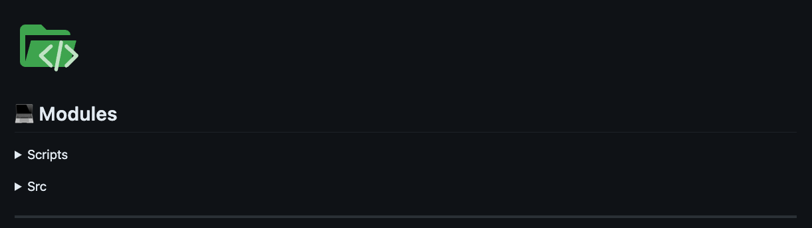
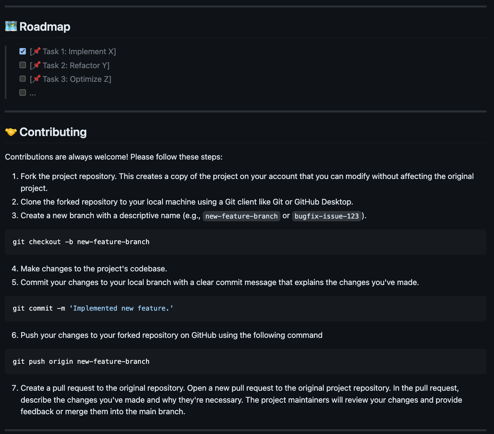
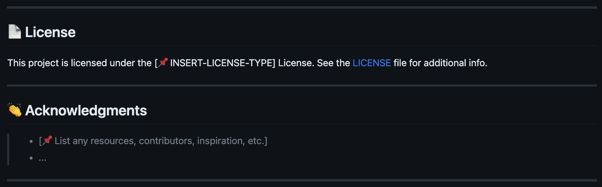

<div align="center">
  <h1 align="center">
    
    
    <br>
    README-AI
  </h1>

> <h3 align="center">🚀 Generate beautiful and informative README Markdown files!</h3>
> <h3 align="center">⚙️ Powered by OpenAI's language model APIs and the tools below:</h3>
>  <p align="center">
>   
>   
>   
>   
>   
>   
>   
> </p>

</div>

---

## 📍 Table of Contents

- [📍 Table of Contents](#-table-of-contents)
- [🤖 Overview](#-overview)
    - [🎯 *Motivations*](#-motivations)
    - [⚠️ *Disclaimers*](#️-disclaimers)
- [🔮 Features](#-features)
- [🚀 Getting Started](#-getting-started)
  - [✅ Dependencies](#-dependencies)
    - [📂 Repository](#-repository)
    - [🔐 OpenAI API Setup](#-openai-api-setup)
  - [💻 Installation](#-installation)
  - [🎮 Using README-AI](#-using-readme-ai)
  - [🧪 Running Tests](#-running-tests)
- [🛠 Future Development](#-future-development)
- [🤝 Contributing](#-contributing)
- [📄 License](#-license)
- [👏 Acknowledgments](#-acknowledgments)

---

## 🤖 Overview

README-AI is a powerful, user-friendly tool that generates extensive README markdown documents for your software and data projects. By providing a remote repository URL or directory path to your codebase, this command-line tool will document your entire project, leveraging the capabilities of large language models and OpenAI's GPT APIs.

#### 🎯 *Motivations*

README-AI simplifies the process of writing and maintaining high-quality project documentation. My aim for this project is to provide all skill levels a tool that improves their technical workflow, in an efficient and user-friendly manner. Ultimately, the goal of README-AI is to improve the adoption and usability of open-source projects, enabling everyone to better understand and use open-source tools!
#### ⚠️ *Disclaimers*

README-AI is currently under development and has an opinionated configuration and setup. While this tool provides an excellent starting point for documentation, its important to review all text generated by the OpenAI API to ensure it accurately represents your codebase. 

Additionally, remember to regularly monitor your API usage and costs by visiting the [OpenAI API Usage](https://platform.openai.com/account/usage).

<p align="right">
  <a href="#top"><b>🔝 Return </b></a>
</p>

---

## 🔮 Features

<h1 align="center">1.<br>👇<br><br>🔖 Codebase Documentation</h1>
<table>
  <tr>
    <td>
      <h3>📍 Code-to-Text Summaries</h3>
      <ul>
        <li>Code summaries of each script in your repository are generated via OpenAI's large language model APIs, such as gpt-3.5-turbo.</li>
        <li>Your codebase is parsed and file contents are converted to natural language, and displayed in Markdown table format.</li>
      </ul>
    </td>
  </tr>
  <tr>
    <td>
      
      <h1 align="center">↕️</h1>
      
    </td>
  </tr>
</table>
</p>

<h1 align="center">⒉<br>👇<br><br>🎖 Badges</h1>
<table>
  <tr>
    <td>
      <h3>📍 Introduction, Badges, Table of Contents</h3>
      <ul>
        <li>The OpenAI API generates a 1-sentence phrase describing your project.</li>
        <li>Project dependencies and software visualized using beautiful SVG icon badges.</li>
        <li>Badges are sorted by hex code, displayed from light to dark hues.</li>
        <li>A table of contents is also provided for your README.md file.</li>
        </li>
      </ul>
      <br>
    </td>
  </tr>
  <tr>
    <td>
      
    </td>
  </tr>
</table>
</p>

<h1 align="center">⒊<br>👇<br><br>🧚 Prompted Text Generation</h1>
<table>
  <tr>
    <td>
      <h3>📍 Features Table & Overview</h3>
      <ul>
        <li>The <i>Overview</i> section describes your project's use case and applications.</li>
        <li>The <i>Features</i> table highlights various technical attributes of your codebase.</li>
        <ul>
          <li>README-AI uses detailed prompt templates, embedded with your repository's metadata, and passed to the OpenAI API.</li>
          <li>Currently fine-tuning the prompts to improve the accuracy and relevance of the API responses.</li>
        </ul>
      </ul>
    </td>
  </tr>
  <tr>
    <td>
      
      
    </td>
  </tr>
</table>
</p>

<h1 align="center">⒋<br>👇<br><br>🌲 Repository Tree</h1>
<p align="center">Why not a directory tree as well? Visualize your codebase structure in your README.
</p>

|                               |
|-------------------------------|
|  |


<h1 align="center">⒌<br>👇<br><br>📦 Dynamic User Setup Guides</h1>
<table>
  <tr>
    <td>
      <h3><b>📍 Installation, Usage, and Running Tests</b></h3>
        <ul>
          <li>Dynamically generates instructions for installing, using, and testing your codebase.</li>
          <li>This section of your README.md will help others easily setup and use your project!</li>
          <li>README-AI currently supports this feature for code written with:</li>
          <ul>
            <li>
              <i>Python, Rust, Go, C, Kotlin, Java, JavaScript, TypeScript.</i>
            </li>
          </ul>
        </ul>
    </td>
  </tr>
  <tr>
    <td>
      
    </td>
  </tr>
</table>

<h1 align="center">⒍<br>👇<br><br>👩‍💻Contributing Guidelines & more!</h1>
<p align="center">Adds additional standard sections to build out a robust README file!</p>

|                               |
|-------------------------------|
|  |
|  |

<h1 align="center">⒎<br>👇<br><br>💥 Example Files</h1>
<p align="center">Markdown example files generated by the README-AI app!</p>
<div align="center">
  <table align="center">
    <tr>
      <th></th>
      <th>Example File</th>
      <th>Repository</th>
      <th>Language</th>
      <th>Bytes</th>
    </tr>
    <tr>
      <td>1️⃣</td>
      <td><a href="https://github.com/eli64s/README-AI/blob/main/docs/README_Python.md">README-Python.md</a></td>
      <td><a href="https://github.com/eli64s/README-AI">readme-ai</a></td>
      <td>Python</td>
      <td><p>19,839</p>
    </tr>
      <td>2️⃣</td>
      <td><a href="https://github.com/eli64s/README-AI/blob/main/docs/README_TypeScript.md">README-TypeScript.md</a></td>
      <td><a href="https://github.com/Yuberley/ChatGPT-App-React-Native-TypeScript">chatgpt-app-react-typescript</a></td>
      <td>TypeScript, React</td>
      <td><p>988</p>
    </tr>
    <tr>
      <td>3️⃣</td>
      <td><a href="https://github.com/eli64s/README-AI/blob/main/docs/README_JavaScript_GPT.md">README-JavaScript.md</a></td>
      <td><a href="https://github.com/idosal/assistant-chat-gpt">assistant-chat-gpt-javascript</a></td>
      <td>JavaScript, React</td>
      <td><p>212</p>
    </tr>
    <tr>
      <td>4️⃣</td>
      <td><a href="https://github.com/eli64s/README-AI/blob/main/docs/README_Kotlin.md">README-Kotlin.md</a></td>
      <td><a href="https://github.com/rumaan/file.io-Android-Client">file.io-android-client</a></td>
      <td>Kotlin, Java, Android</td>
      <td><p>113,649</p>
    </tr>
    <tr>
      <td>5️⃣</td>
      <td><a href="https://github.com/eli64s/README-AI/blob/main/docs/README_RUST_C.md">README-Rust-C.md</a></td>
      <td><a href="https://github.com/DownWithUp/CallMon">rust-c-app</a></td>
      <td>C, Rust</td>
      <td><p>72</p>
    </tr>
    <tr>
      <td>6️⃣</td>
      <td><a href="https://github.com/eli64s/README-AI/blob/main/docs/README_Go.md">README-Go.md</a></td>
      <td><a href="https://github.com/olliefr/docker-gs-ping">go-docker-app</a></td>
      <td>Go</td>
      <td><p>41</p>
    </tr>
    <tr>
      <td>7️⃣</td>
      <td><a href="https://github.com/eli64s/README-AI/blob/main/docs/README_Java.md">README-Java.md</a></td>
      <td><a href="https://github.com/avjinder/Minimal-Todo">java-minimal-todo</a></td>
      <td>Java</td>
      <td><p>17,725</p>
    </tr>
    <tr>
      <td>8️⃣</td>
      <td><a href="https://github.com/eli64s/README-AI/blob/main/docs/README_FastAPI_Redis.md">README-FastAPI-Redis.md</a></td>
      <td><a href="https://github.com/FerrariDG/async-ml-inference">async-ml-inference</a></td>
      <td>Python, FastAPI, Redis</td>
      <td><p>355</p>
    </tr>
    <tr>
      <td>9️⃣</td>
      <td><a href="https://github.com/eli64s/README-AI/blob/main/docs/README_MLOps.md">README-Python-MLOps.md</a></td>
      <td><a href="https://github.com/GokuMohandas/mlops-course">mlops-course</a></td>
      <td>Python, Jupyter</td>
      <td><p>8,524</p>
    </tr>
    <tr>
      <td>🔟</td>
      <td><a href="https://github.com/eli64s/README-AI/blob/main/docs/README_PyFlink.md">README-Apache-Flink.md</a></td>
      <td>local directory</td>
      <td>PyFlink</td>
      <td><p>32</p>
    </tr>
  </table>
</div>


<h1 align="center">⒏<br>👇<br><br>📜 Custom README template formats coming soon!</h1>
<p align="center">Developing a feature that allows users to select from a variety of README formats and styles.</p>
<p align="center">Custom templates will focus on README focused on data, ai & ml, research, minimal, and more!</p>

<p align="right">
  <a href="#top"><b>🔝 Return </b></a>
</p>

---

## 🚀 Getting Started

### ✅ Dependencies

Before you begin, ensure that you have the following prerequisites installed:

- Python 3.8 or higher
- Conda package manager (recommended)
- Access to the OpenAI API (see OpenAI setup guide below)

#### 📂 Repository

Most user's will run README-AI using the command-line interface, specifying their repository on run-time. However, if you would like to use the default configuration, you will need to update the [configuration file](./conf/conf.toml) with your repository's remote URL (GitHub, GitLab) or local directory pat on your machine.

```toml
# Repository Configuration
[git]
repository = "INSERT YOUR REPOSITORY URL / LOCAL DIRECTORY"
```

#### 🔐 OpenAI API Setup

To use the README-AI application, you will need to create an account with OpenAI to generate an API key. The steps below outline this setup process:

<details closed><summary>OpenAI API User Guide</summary>

1. Go to the [OpenAI website](https://platform.openai.com/).
2. Click the "Sign up for free" button.
3. Fill out the registration form with your information and agree to the terms of service.
4. Once logged in, click on the "API" tab.
5. Follow the instructions to create a new API key.
6. Copy the API key and keep it in a secure place.

</details>
<br>

> ⚠️ **Note:**
>
> - To maximize your experience with README-AI, it is recommended to set up a payment method on OpenAI's website. By doing so, you gain access to more powerful language models like gpt-3.5-turbo. Without a payment method, your usage will be restricted to the base gpt-3 models. This limitation might lead to less precise README files or potential errors during the generation process.
> 
> - When using a payment method, make sure you have sufficient credits to run the README-AI application. Additionally, remember to regularly monitor your API usage and costs by visiting the [OpenAI API Usage Dashboard](https://platform.openai.com/account/usage). Please note that this API is not free and you will be charged for each request made, which can accumulate rapidly. 
> 
> - The generation of the README.md file should typically complete in under 1 minute. If it takes longer than a few minutes, please terminate the process.
> 

---

### 💻 Installation

1. Clone the README-AI repository:

```sh
git clone https://github.com/eli64s/README-AI.git && cd README-AI
```

2. Create a Conda environment and install the required dependencies:

```sh
# With Bash
bash setup/setup.sh

# With Conda
conda env create -f setup/environment.yaml
conda activate readme_ai
pip install -r requirements.txt
```

3. Set up the OpenAI API key by creating an environment variable:

```sh
export OPENAI_API_KEY=<your-api-key>
```

### 🎮 Using README-AI

Use the command-line to provide the OpenAI API key (if not already set) and specify an output path for your README file, along with the path to your local repository or remote code repository.

Command-Line Arguments:

- `--api_key` : Provide your OpenAI API key.
- `--output` : Provide a path where to write the output file.
- `--repository` : Provide a remote Git URL or a local directory.

```sh
python src/main.py --api_key skabc123 --output README_AI.md --repository https://github.com/eli64s/README-AI
```

Alternatively, run the bash script to run README-AI with the default configuration.

```sh
bash scripts/run.sh
```

### 🧪 Running Tests

To run the unit-tests for README-AI, use the following command.

```bash
bash scripts/test.sh
```

<p align="right">
  <a href="#top"><b>🔝 Return </b></a>
</p>

---

## 🛠 Future Development

- [X] Add additional language support for populating the *installation*, *usage*, and *test* README sections.
- [ ] Design and implement a variety of README template formats and styles.
- [ ] Add feature to select the output language of the README file (i.e. CN, ES, FR, JA, KO, RU).
- [ ] Create UI with [Textual](https://github.com/Textualize/textual) or another framework to improve user experience.

---

## 🤝 Contributing

Contributions are welcomed and encouraged! Please follow these steps in the [Contributing Guidelines](./CONTRIBUTING.md), thank you!

---

## 📄 License

This project is licensed under the MIT License - see the [LICENSE](./LICENSE) file for details.

---

## 👏 Acknowledgments

*SVG Icons*
  - [Aveek-Saha/GitHub-Profile-Badges](https://github.com/Aveek-Saha/GitHub-Profile-Badges)
  - [Ileriayo/Markdown-Badges](https://github.com/Ileriayo/markdown-badges)

<p align="right">
  <a href="#top"><b>🔝 Return </b></a>
</p>

---
