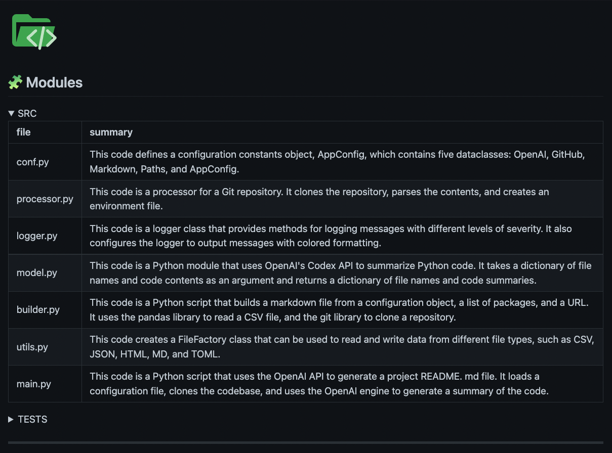
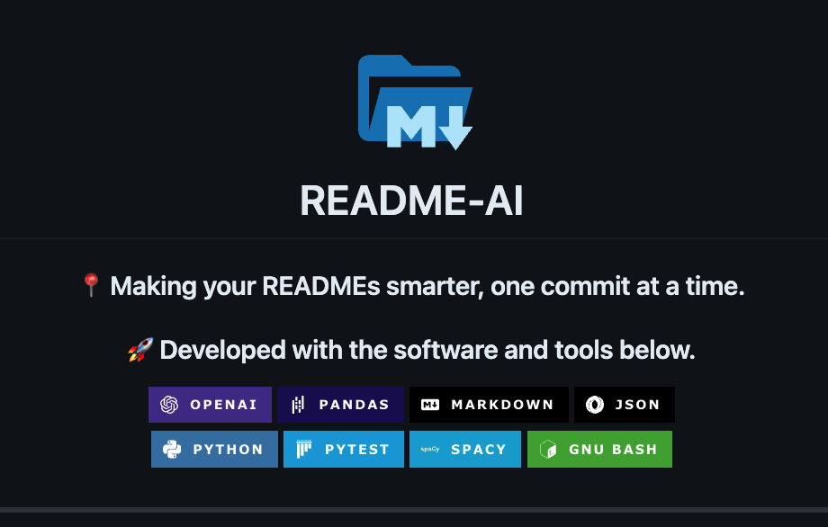
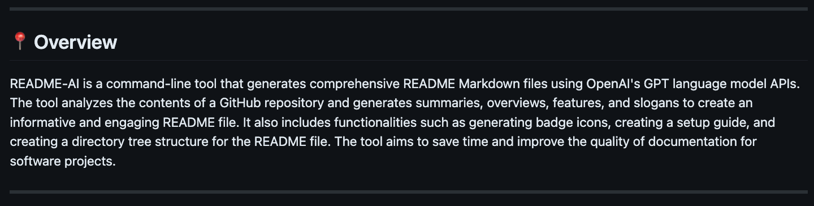
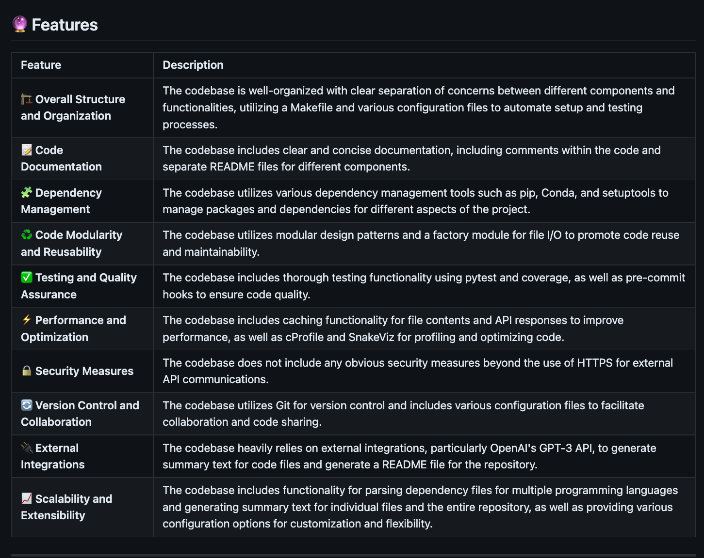
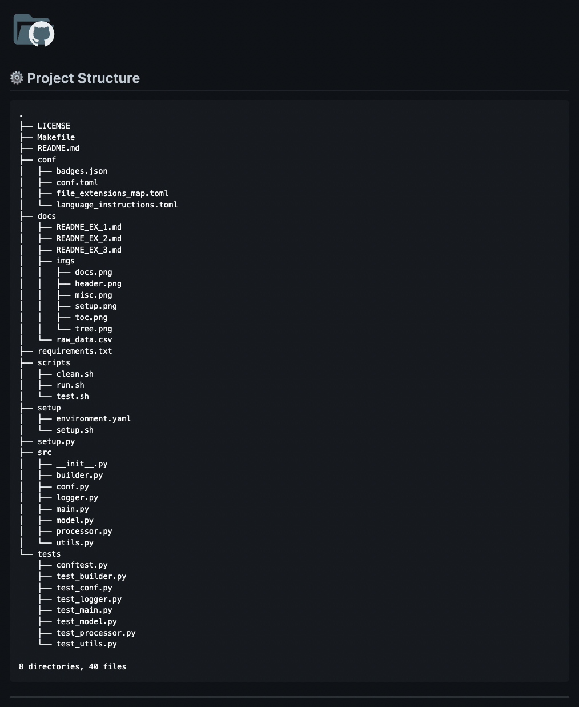
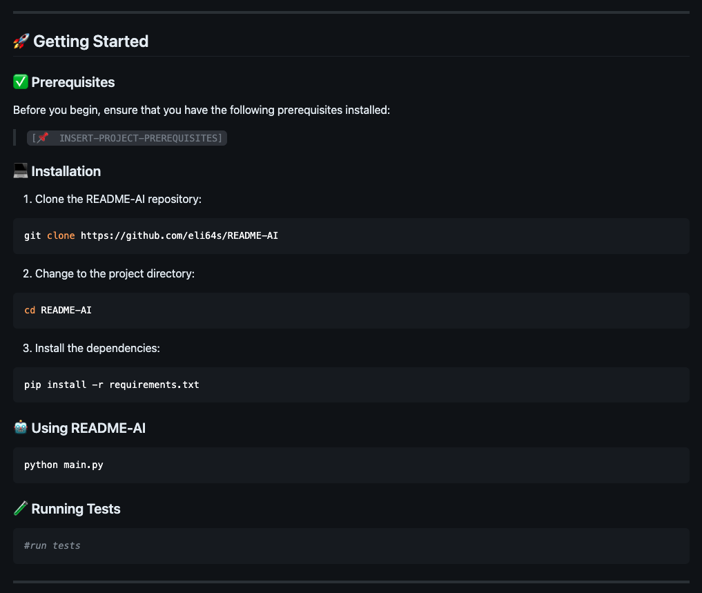
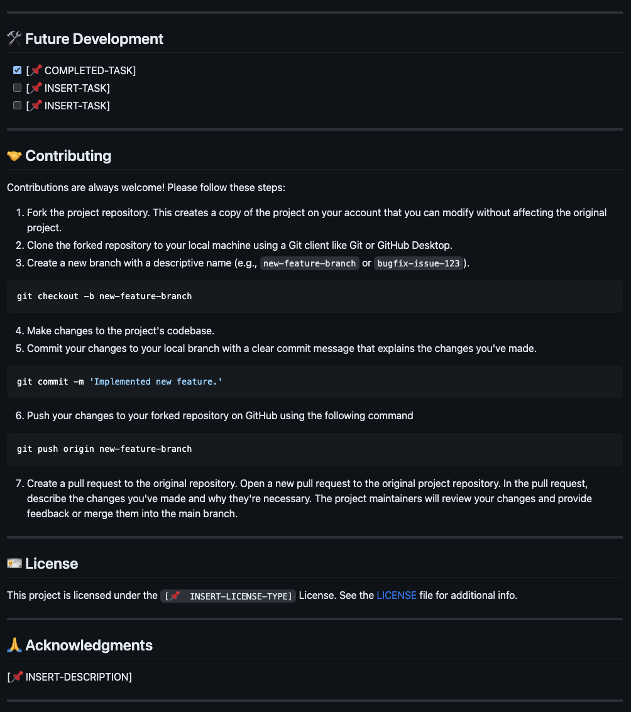

<div align="center">
  <h1 align="center">
    
    <br>README-AI</h1>

> <h3 align="center">🚀 Generate aesthetic, structured, and informative README.md files </h3>
> <h3 align="center">⚙️ Powered by OpenAI's GPT language model APIs and the software below:</h3>
>  <p align="center">
>   
>   
>   
>   
>   
>   
>   
> </p>

</div>

---

## 📍 Table of Contents

- [📍 Table of Contents](#-table-of-contents)
- [🤖 Overview](#-overview)
- [🔮 Features](#-features)
- [🚀 Getting Started](#-getting-started)
  - [✅ Dependencies](#-dependencies)
    - [📂 Repository](#-repository)
    - [🔐 OpenAI API Setup](#-openai-api-setup)
  - [💻 Installation](#-installation)
  - [🪄 Using README-AI](#-using-readme-ai)
  - [🧪 Running Tests](#-running-tests)
- [🛠 Future Development](#-future-development)
- [🤝 Contributing](#-contributing)
- [🪪 License](#-license)
- [🙏 Acknowledgments](#-acknowledgments)

---

## 🤖 Overview

README-AI is a powerful, user-friendly tool that automatically generates high-quality README files for your Git repositories using OpenAI's language model APIs. By simply providing the path or url to your project's codebase, this tool will craft a well-structured and comprehensive README that highlights your project's features, installation steps, usage instructions, and more.

> ⚠️ **Note:**
>
> This project is currently under development and has an opinionated configuration and setup. While README-AI provides an excellent starting point for any project that requires documentation, it is important to review all text that is generated by the OpenAI API to ensure that it accurately represents your codebase.

<p align="right">
  <a href="#top"><b>🔝 Return </b></a>
</p>

---

## 🔮 Features

<h1 align="center">1.<br>👇<br><br>🔖 Codebase Documentation</h1>
<table>
  <tr>
    <td>
      <h3>📍 Code Summaries</h3>
      <ul>
        <li>Code summaries of each script in your repository are generated by OpenAI's<br> <code>text-davinci-003</code> model.</li>
        <li>Your codebase is parsed and file contents are converted to natural language, and displayed and organized in table format.</li>
      </ul>
    </td>
  </tr>
  <tr>
    <td>
      
    </td>
  </tr>
</table>
</p>

<h1 align="center">⒉<br>👇<br><br>🪪 Badges</h1>
<table>
  <tr>
    <td>
      <h3>📍 Introduction, Badges, Table of Contents</h3>
      <ul>
        <li>Project dependencies and software visualized using beautiful SVG icon badges!
        <li>Additionally, the OpenAI <code>text-davinci-003</code> model generates a 1-sentence phrase describing your project.</li>
        <li>A table of contents is also provided for your README.</li>
        </li>
      </ul>
      <br>
    </td>
  </tr>
  <tr>
    <td>
      
    </td>
  </tr>
</table>
</p>

<h1 align="center">⒊<br>👇<br><br>🧚 Text Generation</h1>
<table>
  <tr>
    <td>
      <h3>📍 Overview & Features</h3>
      <ul>
        <li>Generated using detailed prompts that are embedded with your repository metadata.</li><li>Working on fine-tuning the prompts to improve the accuracy and relevance to your project.</li>
      </ul>
    </td>
  </tr>
  <tr>
    <td>
      
      
    </td>
  </tr>
</table>
</p>

<h1 align="center">⒋<br>👇<br><br>🌲 Repository Tree</h1>
<p align="center">Why not a directory tree as well? Visualize your codebase structure in your README.
</p>

|                               |
|-------------------------------|
|  |


<h1 align="center">⒌<br>👇<br><br>📦 Project Setup and User Guide</h1>
<p align="center">Dynamically generates installation and run guides to help others explore and use your code!</p>

<table>
  <tr>
    <td>
     <h3><b>📍 Setup</b></h3><br>
      <p>Support for:</p>
      <ul>
        <li>Python</li>
        <li>Rust</li>
        <li>Go</li>
        <li>C</li>
        <li>Java</li>
        <li>JavaScript</li>
        <li>TypeScript</li>
      </ul>
    </td>
    <td>
      
    </td>
  </tr>
</table>

<h1 align="center">⒍<br>👇<br><br>👩‍💻Contributing Guidelines & more!</h1>
<p align="center">Adds additional standard sections to build out a robust README file!</p>

|                               |
|-------------------------------|
|  |

<h1 align="center">⒎<br>👇<br><br>💥 Example Files</h1>
<p align="center">Markdown example files produced by the README-AI app!</p>
<div align="center">
  <table align="center">
    <tr>
      <th></th>
      <th>Example File</th>
      <th>Repository</th>
      <th>Language</th>
      <th>Bytes</th>
    </tr>
    <tr>
      <td>1️⃣</td>
      <td><a href="https://github.com/eli64s/README-AI/blob/main/docs/README_Python.md">README-Python.md</a></td>
      <td><a href="https://github.com/eli64s/README-AI">readme-ai</a></td>
      <td>Python</td>
      <td><p>15,459,624</p>
    </tr>
      <td>2️⃣</td>
      <td><a href="https://github.com/eli64s/README-AI/blob/main/docs/README_TypeScript.md">README-TypeScript.md</a></td>
      <td><a href="https://github.com/Yuberley/ChatGPT-App-React-Native-TypeScript">chatgpt-app-react-ts</a></td>
      <td>TypeScript, JavaScript, React</td>
      <td><p>770,708</p>
    </tr>
    </tr>
      <td>3️⃣</td>
      <td><a href="https://github.com/eli64s/README-AI/blob/main/docs/README_JavaScript.md">README-JavaScript.md</a></td>
      <td><a href="https://github.com/cometchat-pro/javascript-react-chat-app">react-chat-app</a></td>
      <td>JavaScript, React, Redux</td>
      <td><p>64,860,374</p>
    </tr>
    <tr>
    <tr>
      <td>4️⃣</td>
      <td><a href="https://github.com/eli64s/README-AI/blob/main/docs/README_FastAPI_Redis.md">README-FastAPI-Redis.md</a></td>
      <td><a href="https://github.com/FerrariDG/async-ml-inference">async-ml-inference</a></td>
      <td>Python, FastAPI, Redis</td>
      <td><p>285,998</p>
    </tr>
    <tr>
      <td>5️⃣</td>
      <td><a href="https://github.com/eli64s/README-AI/blob/main/docs/README_RUST_C.md">README-Rust-C.md</a></td>
      <td><a href="https://github.com/DownWithUp/CallMon">rust-c-app</a></td>
      <td>Rust, C</td>
      <td><p>72,750</p>
    </tr>
    <tr>
      <td>6️⃣</td>
      <td><a href="https://github.com/eli64s/README-AI/blob/main/docs/README_Java.md">README-Java.md</a></td>
      <td><a href="https://github.com/avjinder/Minimal-Todo">java-minimal-todo</a></td>
      <td>Java</td>
      <td><p>18,240,095</p>
    </tr>
      <tr>
      <td>7️⃣</td>
      <td><a href="https://github.com/eli64s/README-AI/blob/main/docs/README_Go.md">README-Go.md</a></td>
      <td><a href="https://github.com/olliefr/docker-gs-ping">go-docker-app</a></td>
      <td>Go</td>
      <td><p>70,707</p>
    </tr>
    <tr>
      <td>8️⃣</td>
      <td><a href="https://github.com/eli64s/README-AI/blob/main/docs/README_MLOps.md">README-Python-MLOps.md</a></td>
      <td><a href="https://github.com/GokuMohandas/mlops-course">mlops-course</a></td>
      <td>Python, Jupyter</td>
      <td><p>8,698,890</p>
    </tr>
    <tr>
      <td>9️⃣</td>
      <td><a href="https://github.com/eli64s/README-AI/blob/main/docs/README_PyFlink.md">README-Apache-Flink.md</a></td>
      <td>local directory</td>
      <td>PyFlink</td>
      <td><p>------------</p>
    </tr>
  </table>
</div>


<h1 align="center">⒏<br>👇<br><br>📜 Custom templates and styles coming soon!</h1>
<p align="center">Developing a feature that allows the user to select from a variety of README formats and styles.</p>
<p align="center">Example template options include data and ML focused, research, hackathons, minimal, and more!</p>

<p align="right">
  <a href="#top"><b>🔝 Return </b></a>
</p>

---

## 🚀 Getting Started

### ✅ Dependencies

Before you begin, ensure that you have the following prerequisites installed:

- Python 3.7 or higher
- Conda package manager (recommended)
- Access to the OpenAI API (see OpenAI API Setup below)

#### 📂 Repository

Most user's will run README-AI using the command-line interface, specifying their repository on run-time. However, if you would like to use the default configuration, you will need to update the [configuration file](./conf/conf.toml) with your repository's remote URL (GitHub, GitLab) or local directory pat on your machine.

```toml
[git]
name = "AUTO-POPULATED BY THE README-AI TOOL"
repository = "INSERT A REMOTE GIT URL OR LOCAL DIRECTORY PATH"
```

#### 🔐 OpenAI API Setup

To use README-AI, you will need an API key for OpenAI. Follow the steps below to create an API key:

<details closed>
<summary>User Guide - OpenAI API</summary>

1. Go to the [OpenAI website](https://platform.openai.com/).
2. Click the "Sign up for free" button.
3. Fill out the registration form with your information and agree to the terms of service.
4. Once logged in, click on the "API" tab.
5. Follow the instructions to create a new API key.
6. Copy the API key and keep it in a secure place.

</details>

### 💻 Installation

1. Clone the README-AI repository:

```sh
git clone https://github.com/eli64s/README-AI.git && cd README-AI
```

2. Create a Conda environment and install the required dependencies:

```sh
# With Bash
bash setup/setup.sh

# With Conda
conda env create -f setup/environment.yaml
conda activate readmeai
pip install -r requirements.txt
```

3. Set up the OpenAI API key by creating an environment variable:

```sh
export OPENAI_API_KEY=<your-api-key>
```

### 🪄 Using README-AI

Use the command-line to provide the OpenAI API key (if not already set) and specify an output path for your README file, along with the path to your local repository or remote code repository.

Command-Line Arguments:

- `--api_key` : Provide your OpenAI API key.
- `--output` : Provide a path where to write the output file.
- `--repository` : Provide a remote Git URL or a local directory.

```sh
python src/main.py --api_key skabc123 --output README_AI.md --repository https://github.com/eli64s/README-AI
```

Alternatively, run the bash script to run README-AI with the default configuration.

```sh
bash scripts/run.sh
```

### 🧪 Running Tests

To run the unit-tests for README-AI, use the following command.

```basg
bash scripts/test.sh
```

<p align="right">
  <a href="#top"><b>🔝 Return </b></a>
</p>

---

## 🛠 Future Development

- [X] Add additional language setup guides for populating the `🚀 Getting Started` README section.
- [ ] Implement multiple README templates with different formats and styling.
- [ ] Add feature to select the language of text written to the README file.
- [ ] Add a UI using Textualize or another framework.

---

## 🤝 Contributing

Contributions are welcomed and encouraged! Please follow these steps in the [Contributing Guidelines](./CONTRIBUTING.md), thank you!

---

## 🪪 License

This project is licensed under the MIT License - see the [LICENSE](./LICENSE) file for details.

---

## 🙏 Acknowledgments

*SVG Icons*
  - [Aveek-Saha/GitHub-Profile-Badges](https://github.com/Aveek-Saha/GitHub-Profile-Badges)
  - [Ileriayo/Markdown-Badges](https://github.com/Ileriayo/markdown-badges)

<p align="right">
  <a href="#top"><b>🔝 Return </b></a>
</p>

---