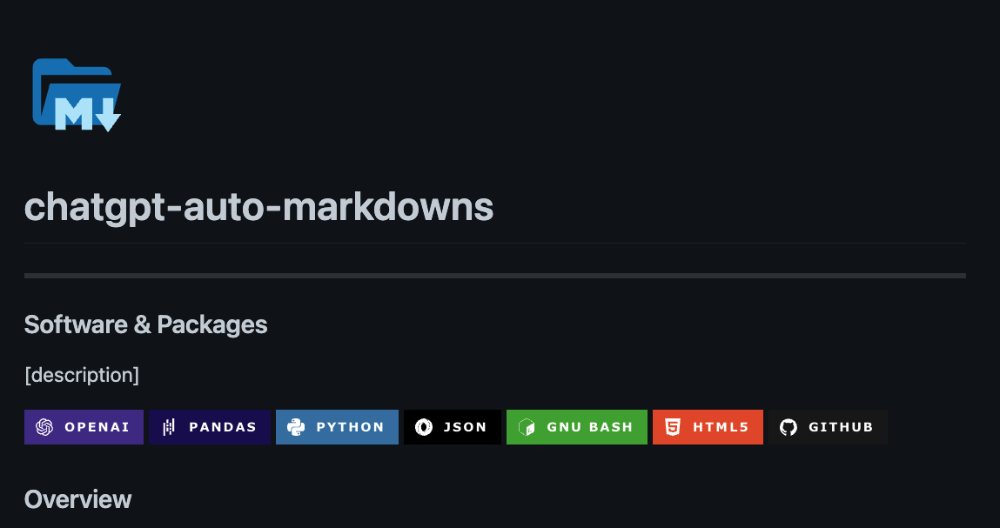
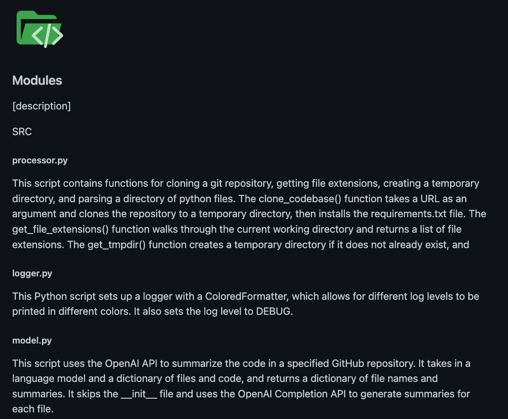

<div align="center">

<h1 align="center">
    <p>🤖 ChatGPT Automated Markdown Documentation</p></h1><b>Generate structured Markdown boilerplate docs to kickstart your data and software projects!</b><br><br>


</div>

---

## Overview

This project leverages the base GPT Davinci model from OpenAI to translate a repository of Python code to documentaion. Features include:

1. Automated header badge icons related to your project dependencies.
2. Generates summaries of each `.py` file from the input GitHub repository.
3. Creates a structured output Markdown template containing the project documentation.
4. Generates repository file directory tree.
5. [Automated docstrings](https://github.com/cdesarmeaux/autodocstrings) - `bash scripts/auto_docstrs.sh`

The images below contain sample outputs of what the project generates so far.

> Document header with codebase package badges.



> Document header with codebase package badges.



> Note: automated templates will always have a very opinionated setup that you should update and adapt for your own needs, but it might be a good starting point for your project.

## Requirements

- OpenAI API: generate a new API key on their [website](https://beta.openai.com/docs/introduction).

---

## Usage

```Bash
# 1. Clone GitHub repository.
git clone https://github.com/eli64s/chatgpt-automated-markdowns && cd chatgpt-automated-markdowns

# 2. Setup conda virtual environment.
make conda

# 3. Run the model.
bash scripts/run_model.sh
```

<a style="vertical-align:middle">

<span style="vertical-align:middle">
<h2>Repository</h2></span></a>

```shell
.
├── Makefile
├── README.md
├── conf
│   ├── conf.toml
│   └── data
│       └── icons.json
├── docs
│   ├── html_docs.html
│   ├── output.md
│   ├── png
│   │   ├── body.png
│   │   └── header.png
│   ├── raw_docs.csv
│   └── tree.md
├── pyproject.toml
├── requirements.txt
├── scripts
│   ├── auto_docstrs.sh
│   └── run_main.sh
├── setup.py
└── src
    ├── __init__.py
    ├── builder.py
    ├── conf.py
    ├── logger.py
    ├── main.py
    ├── model.py
    ├── processor.py
    └── utils.py
```

<html>
<body>
<a style="vertical-align:middle">

<span style="vertical-align:middle">
<h2>Modules</h2></span></a>
<div><details closed>
<summary>SRC</summary>
<h5>processor.py</h5>
<p>This script contains functions for cloning a git repository, getting file extensions, creating a temporary directory, and parsing a directory of python files. The clone_codebase() function takes a URL as an argument and clones the repository to a temporary directory, then installs the requirements.txt file. The get_file_extensions() function walks through the current working directory and returns a list of file extensions. The get_tmpdir() function creates a temporary directory if it does not already exist, and</p>

<h5>logger.py</h5>
<p>This Python script sets up a logger with a ColoredFormatter, which allows for different log levels to be printed in different colors. It also sets the log level to DEBUG.</p>

<h5>model.py</h5>
<p>This script uses the OpenAI API to summarize the code in a specified GitHub repository. It takes in a language model and a dictionary of files and code, and returns a dictionary of file names and summaries. It skips the __init__ file and uses the OpenAI Completion API to generate summaries for each file.</p>

<h5>builder.py</h5>
<p>This script is used to create an HTML file from a CSV file. It imports the Pandas library and a custom utils library. It defines two functions: get_pkg_icons() and create_html(). The get_pkg_icons() function takes a path to a JSON file and returns a dictionary of icons. The create_html() function takes a configuration object, a list of badges, a name, and a path to a CSV file. It creates a header for the HTML</p>

<h5>utils.py</h5>
<p>This Python script contains four functions. The first function, get_pkgs_list(), reads a requirements.txt file and returns a list of packages. The second function, read_json(), reads a json file and returns the contents as a dictionary. The third function, write_file(), writes a file to a given path. The fourth function, md(), converts HTML to Markdown.</p>

<h5>main.py</h5>
<p>This Python script sets up a logger, clones a codebase from a given URL, parses the codebase, creates a summary of the code, creates a list of packages used, creates HTML and Markdown documentation, and writes the documentation to the specified files.</p>
<hr>
</div></body></html>

## Roadmap

- Add compatability for multiple file types.
- Implement data version control - dvc.

---

## References

- [GitHub Profile Badges - Aveek-Saha/GitHub-Profile-Badges](https://github.com/Aveek-Saha/GitHub-Profile-Badges)
- [Automated Docstrings - cdesarmeaux/autodocstrings](https://github.com/cdesarmeaux/autodocstrings)

---
