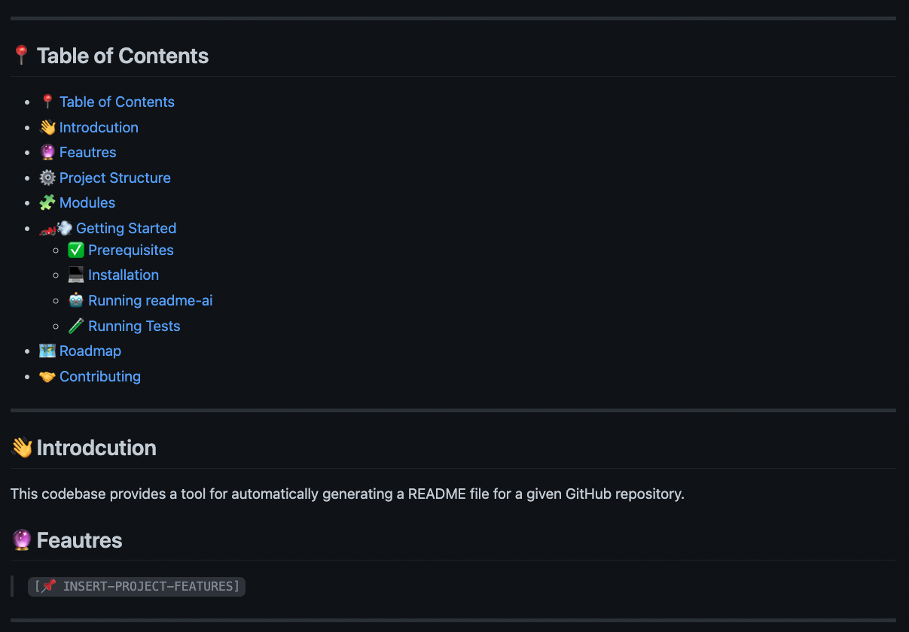

<div align="center">
  <h1 align="center">
    
    <br>README-AI</h1>

> <h3 align="center">🚀 Generate aesthetic, structured, and informative README.md files </h3>
> <h3 align="center">⚙️ Powered by OpenAI's GPT language model APIs and the software below</h3>
>  <p align="center">
>   
>   
>   
>   
>   
>   
>   
> </p>

</div>

---

## 📍 Table of Contents

- [📍 Table of Contents](#-table-of-contents)
- [🤖 Overview](#-overview)
- [🔮 Features](#-features)
- [🚀 Getting Started](#-getting-started)
  - [✅ Dependencies](#-dependencies)
    - [📂 GitHub Repository](#-github-repository)
    - [🔐 OpenAI API Setup](#-openai-api-setup)
  - [💻 Installation](#-installation)
  - [🪄 Using README-AI](#-using-readme-ai)
  - [🧪 Running Tests](#-running-tests)
- [🛠 Future Development](#-future-development)
- [🤝 Contributing](#-contributing)
- [🪪 License](#-license)
- [🙏 Acknowledgments](#-acknowledgments)

---

## 🤖 Overview

README-AI is a powerful, user-friendly tool that automatically generates high-quality README files for your GitHub repositories using OpenAI's language model APIs. By simply providing the path or url to your project's codebase, this tool will craft a well-structured and comprehensive README that highlights your project's features, installation steps, usage instructions, and more.

> **Note:**
>
> This project is currently under development and has an opinionated configuration and setup. While README-AI provides an excellent starting point for any project that requires documentation, it is important to review all text that is generated by the OpenAI API to ensure that it accurately represents your codebase.

<p align="right">
  <a href="#top"><b>🔝 Return </b></a>
</p>

---

## 🔮 Features

<h1 align="center">1.<br>👇<br><br>🔖 Codebase Documentation</h1>
<p align="center">Have you ever met anyone who enjoyed writing documentation for their project? That’s why we're building this project, enjoy!
</p>

|                                                                                                                                                                                                                                                                                        |                             |
| -------------------------------------------------------------------------------------------------------------------------------------------------------------------------------------------------------------------------------------------------------------------------------------- | --------------------------- |
| <br><br/><b>📍 Codebase Documentation</b><br><br>Summaries of each codebase<br> file are generated by OpenAI's<br> `text-davinci-003` model engine.<br><br>The files are converted to natural language, grouped by directory,<br> and formatted in tables. |  |

<h1 align="center">⒉<br>👇<br><br>🪪 Badges</h1>
<p align="center">OpenAI generated introduction sentence and beautiful project badges displayed in the top section of your README.
</p>

|                                                                                                                                                         |                                 |
| ------------------------------------------------------------------------------------------------------------------------------------------------------- | ------------------------------- |
| <b>📍 Introduction and Badges</b><br><br>An introduction sentence is generated by<br> `text-davinci-003` engine.<br><br>Project dependencies are visualized using beautiful SVG icon badges! |  |

<h1 align="center">⒊<br>👇<br><br>🌲 Repository Tree</h1>
<p align="center">Why not a directory tree as well? Visualize your codebase structure in your README.
</p>

|                             |     |
| --------------------------- | --- |
|  |

<h1 align="center">⒋<br>👇<br><br>📚 Table of Contents and Overview</h1>
<p align="center">Adds a table of contents, introduction, and features sections.
</p>

|                                                                                                                                                                                         |                           |
| --------------------------------------------------------------------------------------------------------------------------------------------------------------------------------------- | ------------------------- |
| <br><br/><b>📍 Table of Contents, Overview, & Features</b><br><br>Builds table of contents, overview, and features sections.<br><br> The Overview summary is generated by the OpenAI model. |  |

<h1 align="center">⒌<br>👇<br><br>📦 Project Setup and User Guide</h1>
<p align="center">Creates instructions for setting up and using your codebase. Working on a more dynamic implementation of this section!</p>

|                                                                                                                                                                                               |                               |
| --------------------------------------------------------------------------------------------------------------------------------------------------------------------------------------------- | ----------------------------- |
| <br><br/><b>📍 Getting Started </b><br><br>Dynamically creates a setup<br> guide for others can use your project! Sections include dependencies,<br> installation, and usage, and tests.<br><br>Currently compatible with:<br>Python, Go, Rust, Java, JavaScript.<br> |  |

<h1 align="center">⒍<br>👇<br><br>👩‍💻Contributing Guidelines & more!</h1>
<p align="center">Adds three additional sections to build out a complete README file!</p>

|                             |     |
| --------------------------- | --- |
|  |

<h1 align="center">⒎<br>👇<br><br>💥 Example Files</h1>
<p align="center">Markdown example files produced by the README-AI app!</p>
<div align="center">
  <table align="center">
    <tr>
      <th></th>
      <th>File</th>
      <th>GitHub</th>
      <th>Bytes</th>
    </tr>
    <tr>
      <td>1️⃣</td>
      <td><a href="https://github.com/eli64s/README-AI/blob/main/docs/README_EX_1.md">README_1_PY.md</a></td>
      <td><a href="https://github.com/eli64s/README-AI">readme-ai</a></td>
      <td><p>15,459,624</p>
    </tr>
    <tr>
      <td>2️⃣</td>
      <td><a href="https://github.com/eli64s/README-AI/blob/main/docs/README_EX_2.md">README_2_PY.md</a></td>
      <td><a href="https://github.com/GokuMohandas/mlops-course">mlops-course</a></td>
      <td><p>8,698,890</p>
    </tr>
    <tr>
      <td>3️⃣</td>
      <td><a href="https://github.com/eli64s/README-AI/blob/main/docs/README_EX_JS.md">README_3_JS.md</a></td>
      <td><a href="https://github.com/philnash/react-web-audio">react-web-audio</a></td>
      <td><p>533,233</p>
    </tr>
    <tr>
      <td>4️⃣</td>
      <td><a href="https://github.com/eli64s/README-AI/blob/main/docs/README_EX_RUST.md">README_4_RUST.md</a></td>
      <td><a href="https://github.com/MihaiBogdanEugen/contacts-cli">rust-contacts-cli</a></td>
      <td><p>79,104</p>
    </tr>
    <tr>
      <td>5️⃣</td>
      <td><a href="https://github.com/eli64s/README-AI/blob/main/docs/README_EX_3.md">README_5_FastAPI.md</a></td>
      <td><a href="https://github.com/nofoobar/JobBoard-Fastapi">job-board-fastapi</a></td>
      <td><p>75,391,521</p>
    </tr>
    <tr>
      <td>6️⃣</td>
      <td><a href="https://github.com/eli64s/README-AI/blob/main/docs/README_EX_6_JAVA.md">README_6_JAVA.md</a></td>
      <td><a href="https://github.com/avjinder/Minimal-Todo">java-minimal-todo</a></td>
      <td><p>18,240,095</p>
    </tr>
  </table>
</div>

<p align="right">
  <a href="#top"><b>🔝 Return </b></a>
</p>

---

## 🚀 Getting Started

### ✅ Dependencies

Before you begin, ensure that you have the following prerequisites installed:

- Python 3.7 or higher
- Conda package manager (recommended)
- Access to the OpenAI API (see OpenAI API Setup below)

#### 📂 GitHub Repository

Copy the url of your project's GitHub repository and update the [configuration file](./conf/conf.toml) as seen in the code snippet below. Additionally, you can provide a local path to your repository if you are not using GitHub.

```toml
[github]
local = "INSERT-LOCAL-REPO-PATH"
remote = "INSERT-GITHUB-REPO-URL"
```

#### 🔐 OpenAI API Setup

To use README-AI, you will need an API key for OpenAI. Follow the steps below to create an API key:

<details closed>
<summary>User Guide - OpenAI API</summary>

1. Go to the [OpenAI website](https://platform.openai.com/).
2. Click the "Sign up for free" button.
3. Fill out the registration form with your information and agree to the terms of service.
4. Once logged in, click on the "API" tab.
5. Follow the instructions to create a new API key.
6. Copy the API key and keep it in a secure place.

</details>

### 💻 Installation

1. Clone the README-AI repository:

```sh
git clone https://github.com/eli64s/README-AI.git && cd README-AI
```

2. Create a Conda environment and install the required dependencies:

```sh
# With Bash
bash setup/setup.sh

# With Conda
conda env create -f setup/environment.yaml
conda activate readmeai
pip install -r requirements.txt
```

3. Set up the OpenAI API key by creating an environment variable:

```sh
export OPENAI_API_KEY=<your-api-key>
```

### 🪄 Using README-AI

Use the command-line to provide the OpenAI API key (if not already set) and specify an output path for your README file, along with the path to your local repository or remote code repository.

Command-Line Arguments:

- `--api_key` : Provide your OpenAI API key.
- `--local`  : Provide the full path of a local repository.
- `--output` : Provide a path where to write the output file.
- `--remote` : Provide a URL of a remote GitHub repository.

```sh
python src/main.py --api_key skabc123 --output README_AI.md --remote https://github.com/eli64s/README-AI
```

Alternatively, run the bash script to run README-AI with the default configuration.

```sh
bash scripts/run.sh
```

### 🧪 Running Tests

To run the unit-tests for README-AI, use the following command.

```basg
bash scripts/test.sh
```

<p align="right">
  <a href="#top"><b>🔝 Return </b></a>
</p>

---

## 🛠 Future Development

- [X] Add additional language setup guides for populating the `🚀 Getting Started` README section.
  - Currently compatible with codebases written in: `Python, Go, Rust, Java, JavaScript.`
- [ ] Implement multiple README templates with different formats and styling.
- [ ] Add feature to select the language of text written to the README file.
- [ ] Add UI and robust backend with FastAPI to improve user experience.

---

## 🤝 Contributing

Contributions are welcomed and encouraged! Please follow these steps in the [Contributing Guidelines](./CONTRIBUTING.md), thank you!

---

## 🪪 License

This project is licensed under the MIT License - see the [LICENSE](./LICENSE) file for details.

---

## 🙏 Acknowledgments

*SVG Icons*
  - [Aveek-Saha/GitHub-Profile-Badges](https://github.com/Aveek-Saha/GitHub-Profile-Badges)
  - [Ileriayo/Markdown-Badges](https://github.com/Ileriayo/markdown-badges)

<p align="right">
  <a href="#top"><b>🔝 Return </b></a>
</p>

---
