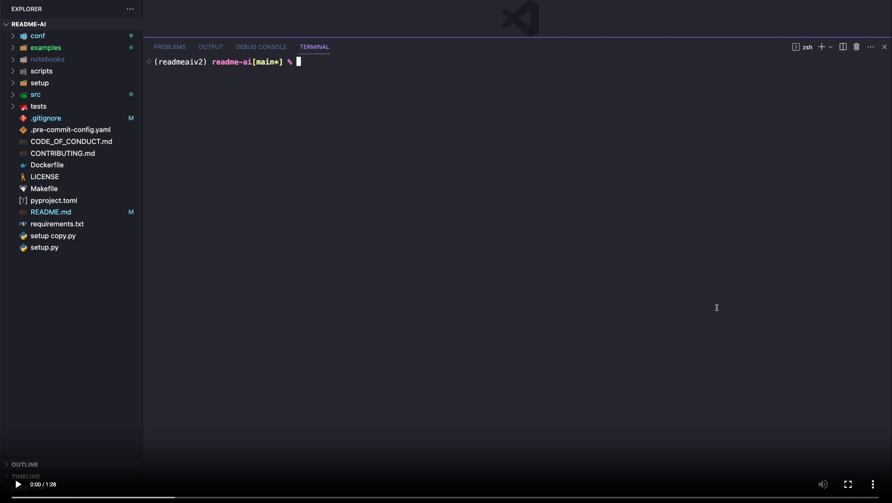

<body>
    <div align="center">
        <h1 align="center">
            
            
            <br>README-AI
        </h1>
        <h3>◦ Generate beautiful and informative README.md documents.</h3>
        <h3>◦ Developed with OpenAI's GPT language model APIs.</h3>
        <br>
        <p align="center">
            
            
            
            
            
            
        </p>
        
        
        
        
    </div>
</body>

---

## 📖 Table of Contents

- [📖 Table of Contents](#-table-of-contents)
- [📍 Overview](#-overview)
    - [🎯 *Motivation*](#-motivation)
    - [⚠️ *Disclaimer*](#️-disclaimer)
- [👾 Demo](#-demo)
- [⚙️ Features](#️-features)
- [🚀 Getting Started](#-getting-started)
  - [✔️ Dependencies](#️-dependencies)
    - [📂 Repository](#-repository)
    - [🔐 OpenAI API](#-openai-api)
  - [📦 Installation](#-installation)
  - [🎮 Using *README-AI*](#-using-readme-ai)
  - [🧪 Running Tests](#-running-tests)
- [🛠 Future Development](#-future-development)
- [📒 Changelog](#-changelog)
- [🤝 Contributing](#-contributing)
- [📄 License](#-license)
- [👏 Acknowledgments](#-acknowledgments)

---

## 📍 Overview

*README-AI* is a powerful, user-friendly command-line tool that generates extensive README markdown documents for your software and data projects. By providing a remote repository URL or directory path to your codebase, this tool will document your entire project, leveraging the capabilities of large language models and OpenAI's GPT APIs.

#### 🎯 *Motivation*

Simplifies the process of writing and maintaining high-quality project documentation. My aim for this project is to provide all skill levels a tool that improves their technical workflow, in an efficient and user-friendly manner. Ultimately, the goal of *README-AI* is to improve the adoption and usability of open-source projects, enabling everyone to better understand and use open-source tools.
#### ⚠️ *Disclaimer*

*README-AI* is currently under development and has an opinionated configuration and setup. While this tool provides an excellent starting point for documentation, its important to review all text generated by the OpenAI API to ensure it accurately represents your codebase. Ensure all content in your repository is free of sensitive information before executing.

Additionally, regularly monitor your API usage and costs by visiting the [OpenAI API Usage](https://platform.openai.com/account/usage).

---

## 👾 Demo

[](https://youtu.be/pl-VcVfGbbk)

---

## ⚙️ Features

<h1 align="center">1.<br>👇<br><br>📑 Codebase Documentation</h1>
<table>
    <tr>
        <td>
            <h3>◦ Repository File Summaries</h3>
            <ul>
                <li>Code summaries are generated for each file via OpenAI's <i>gpt-3.5-turbo</i> engine.</li>
                <li>The File column in the markdown table contains a link to the file on GitHub.</li>
            </ul>
        </td>
    </tr>
    <tr>
        <td>
            
        </td>
    </tr>
</table>

<h1 align="center">⒉<br>👇<br><br>🎖 Badges</h1>
<table>
    <tr>
        <td>
            <h3>◦ Introduction, Badges, & Table of Contents</h3>
            <ul>
                <li>The OpenAI API is prompted to create a 1-sentence phrase describing your project.</li>
                <li>Project dependencies and metadata are visualized using <a href="https://shields.io/">Shields.io</a> badges.</li>
                <li>Badges are sorted by hex code, displayed from light to dark hues.</li>
            </ul>
        </td>
    </tr>
    <tr>
        <td>
            
        </td>
    </tr>
</table>

<h1 align="center">⒊<br>👇<br><br>🧚 Prompted Text Generation</h1>
<table>
    <tr>
        <td>
            <h3>◦ Features Table & Overview</h3>
            <ul>
                <li>Detailed prompts are embedded with repository metadata and passed to the OpenAI API.</li>
                <ul>
                    <li><em>Features</em> table highlights various technical attributes of your codebase.
                    </li>
                    <li><em>Overview</em> section describes your project's use case and applications.
                    </li>
                </ul>
            </ul>
        </td>
    </tr>
    <tr>
        <td>
            
            
        </td>
    </tr>
</table>

<h1 align="center">⒋<br>👇<br><br>🌲 Repository Tree</h1>
<table>
    <tr>
        <td>
            
        </td>
    </tr>
</table>

<h1 align="center">⒌<br>👇<br><br>📦 Dynamic User Setup Guides</h1>
<table>
    <tr>
        <td>
            <h3><b>◦ Installation, Usage, & Testing</b></h3>
            <ul>
                <li>Generates instructions for installing, using, and testing your codebase.</li>
                <li>README-AI currently supports this feature for code written with:</li>
                <ul>
                    <li>
                        <i>Python, Rust, Go, C, Kotlin, Java, JavaScript, TypeScript.</i>
                    </li>
                </ul>
            </ul>
        </td>
    </tr>
    <tr>
        <td>
            
        </td>
    </tr>
</table>

<h1 align="center">⒍<br>👇<br><br>👩‍💻Contributing Guidelines & more!</h1>

| |
|-----------------------------------------------|
|  |

<h1 align="center">⒎<br>👇<br><br>💥 Example Files</h1>
<p align="center">Markdown example files generated by the README-AI app!</p>
<div align="center">
    <table align="center">
        <tr>
            <th></th>
            <th>Example File</th>
            <th>Repository</th>
            <th>Language</th>
            <th>Bytes</th>
        </tr>
        <tr>
            <td>1️⃣</td>
            <td><a href="https://github.com/eli64s/readme-ai/blob/main/examples/readme-python.md">readme-python.md</a></td>
            <td><a href="https://github.com/eli64s/readme-ai">readme-ai</a></td>
            <td>Python</td>
            <td>
                <p>19,839</p>
        </tr>
        <td>2️⃣</td>
        <td><a href="https://github.com/eli64s/readme-ai/blob/main/examples/readme-typescript.md">readme-typescript.md</a></td>
        <td><a href="https://github.com/Yuberley/ChatGPT-App-React-Native-TypeScript">chatgpt-app-react-typescript</a></td>
        <td>TypeScript, React</td>
        <td>
            <p>988</p>
            </tr>
            <tr>
                <td>3️⃣</td>
                <td><a href="https://github.com/eli64s/readme-ai/blob/main/examples/readme-javascript.md">readme-javascript.md</a></td>
                <td><a href="https://github.com/idosal/assistant-chat-gpt">assistant-chat-gpt-javascript</a></td>
                <td>JavaScript, React</td>
                <td>
                    <p>212</p>
            </tr>
            <tr>
                <td>4️⃣</td>
                <td><a href="https://github.com/eli64s/readme-ai/blob/main/examples/readme-kotlin.md">readme-kotlin.md</a></td>
                <td><a href="https://github.com/rumaan/file.io-Android-Client">file.io-android-client</a></td>
                <td>Kotlin, Java, Android</td>
                <td>
                    <p>113,649</p>
            </tr>
            <tr>
                <td>5️⃣</td>
                <td><a href="https://github.com/eli64s/readme-ai/blob/main/examples/readme-rust-c.md">readme-rust-c.md</a></td>
                <td><a href="https://github.com/DownWithUp/CallMon">rust-c-app</a></td>
                <td>C, Rust</td>
                <td>
                    <p>72</p>
            </tr>
            <tr>
                <td>6️⃣</td>
                <td><a href="https://github.com/eli64s/readme-ai/blob/main/examples/readme-go.md">readme-go.md</a></td>
                <td><a href="https://github.com/olliefr/docker-gs-ping">go-docker-app</a></td>
                <td>Go</td>
                <td>
                    <p>41</p>
            </tr>
            <tr>
                <td>7️⃣</td>
                <td><a href="https://github.com/eli64s/readme-ai/blob/main/examples/readme-java.md">readme-java.md</a></td>
                <td><a href="https://github.com/avjinder/Minimal-Todo">java-minimal-todo</a></td>
                <td>Java</td>
                <td>
                    <p>17,725</p>
            </tr>
            <tr>
                <td>8️⃣</td>
                <td><a href="https://github.com/eli64s/readme-ai/blob/main/examples/readme-fastapi-redis.md">readme-fastapi-redis.md</a></td>
                <td><a href="https://github.com/FerrariDG/async-ml-inference">async-ml-inference</a></td>
                <td>Python, FastAPI, Redis</td>
                <td>
                    <p>355</p>
            </tr>
            <tr>
                <td>9️⃣</td>
                <td><a href="https://github.com/eli64s/readme-ai/blob/main/examples/readme-mlops.md">readme-mlops.md</a></td>
                <td><a href="https://github.com/GokuMohandas/mlops-course">mlops-course</a></td>
                <td>Python, Jupyter</td>
                <td>
                    <p>8,524</p>
            </tr>
            <tr>
                <td>🔟</td>
                <td><a href="https://github.com/eli64s/readme-ai/blob/main/examples/readme-pyflink.md">readme-pyflink.md</a></td>
                <td><a href="https://github.com/eli64s/flink-flow">flink-flow</a></td>
                <td>PyFlink</td>
                <td>
                    <p>32</p>
            </tr>
    </table>
</div>


<h1 align="center">⒏<br>👇<br><br>📜 Custom README templates coming soon!</h1>
<p align="center">Developing a feature that allows users to select from a variety of README formats and styles.</p>
<p align="center">Custom templates will be tailored for use-cases such as data, ai & ml, research, minimal, and more!</p>

<p align="right">
    <a href="#top"><b>🔝 Return </b></a>
</p>

---

## 🚀 Getting Started

### ✔️ Dependencies

Before you begin, ensure that you have the following prerequisites installed:

- Python 3.9 or higher
- Conda package manager (recommended)
- Access to the OpenAI API (see the setup guide below)

#### 📂 Repository

Most user's will run README-AI using the command-line interface, specifying their repository on run-time. However, if you would like to use the default configuration, you will need to update the [configuration file](./conf/conf.toml) with your repository's remote URL (GitHub, GitLab) or local directory pat on your machine.

```toml
# Repository Configuration
[git]
repository = "Insert your repository URL or local path here!"
```

#### 🔐 OpenAI API

To use the README-AI application, you will need to create an account with OpenAI to generate an API key. The steps below outline this setup process:

<details closed><summary>OpenAI API User Guide</summary>

1. Go to the [OpenAI website](https://platform.openai.com/).
2. Click the "Sign up for free" button.
3. Fill out the registration form with your information and agree to the terms of service.
4. Once logged in, click on the "API" tab.
5. Follow the instructions to create a new API key.
6. Copy the API key and keep it in a secure place.

</details>
<br>

> **⚠️ Note**
>
> - To maximize your experience with README-AI, it is recommended to set up a payment method on OpenAI's website. By doing so, you gain access to more powerful language models like gpt-3.5-turbo. Without a payment method, your usage will be restricted to the base gpt-3 models. This limitation might lead to less precise README files or potential errors during the generation process.
>
> - When using a payment method, make sure you have sufficient credits to run the README-AI application. Additionally, remember to regularly monitor your API usage and costs by visiting the [OpenAI API Usage Dashboard](https://platform.openai.com/account/usage). Please note that this API is not free and you will be charged for each request made, which can accumulate rapidly.
>
> - The generation of the README.md file should typically complete in under 1 minute. If it takes longer than a few minutes, please terminate the process.
>

---

### 📦 Installation

1. Clone the *readme-ai* repository to your local machine.
```sh
git clone https://github.com/eli64s/readme-ai
```

2. Navigate to the *readme-ai* directory.
```sh
cd readme-ai
```

3. Use one of the following methods to install the required dependencies:

```sh
# With Bash
bash setup/setup.sh
```

```sh
# With Conda
conda create -n readmeai python=3.9 -y && \
conda activate readmeai && \
poetry install
```

```sh
# With Poetry
poetry install
```

```sh
# With Docker
docker pull zeroxeli/readme-ai:0.0.4
```

### 🎮 Using *README-AI*

Use the command-line to provide the OpenAI API key (if not already set) and specify an output path for your README file, along with the path to your local repository or remote code repository. You can also provide the output path in the [configuration file](./conf/conf.toml)

Command-Line Arguments:

- `-k` or `--api-key`: Your OpenAI API key.
- `-o` or `--output`: The output path for your README.md file.
- `-r` or `--repository`: The URL or path to your code repository.
- `-t` or `--template`: The README template format to use. (coming soon!)
- `l` or `--language`: The language of text written in the README file (coming soon!)

```sh
python src/main.py --api-key "YOUR_API_KEY" --output readme-ai.md --repository https://github.com/eli64s/readme-ai
```
Alternatively, export your OpenAI API key as an environment variable and run the following command:

```sh
conda activate readmeai

export OPENAI_API_KEY="YOUR_API_KEY"

python src/main.py -o readme-ai.md -r https://github.com/eli64s/readme-ai
```

```sh
# With Poetry
poetry shell

export OPENAI_API_KEY="YOUR_API_KEY"

poetry run python src/main.py -o readme-ai.md -r https://github.com/eli64s/readme-ai
```

```sh
# Run with Docker
docker run -it \
-e OPENAI_API_KEY="YOUR_API_KEY" \
-v "$(pwd)":/app \
-w /app zeroxeli/readme-ai:0.0.4 \
python src/main.py -o readme-ai.md -r https://github.com/eli64s/readme-ai
```

### 🧪 Running Tests

To run the unit-tests for README-AI, use the following command.

```bash
bash scripts/test.sh
```

<p align="right">
  <a href="#top"><b>🔝 Return </b></a>
</p>

---

## 🛠 Future Development

- [X] Add additional language support for populating the *installation*, *usage*, and *test* README sections.
- [ ] Design and implement a variety of README template formats for different use-cases.
- [ ] Add support for writing the README in any language (i.e. CN, ES, FR, JA, KO, RU).
- [ ] Create UI with [Textual](https://github.com/Textualize/textual) or another framework to improve user experience.

---

## 📒 Changelog

[Changelog](./CHANGELOG.md)

---

## 🤝 Contributing

[Contributing Guidelines](./CONTRIBUTING.md)

---

## 📄 License

[MIT](./LICENSE)

---

## 👏 Acknowledgments

*Badges*
  - [Shields.io](https://shields.io/)
  - [Aveek-Saha/GitHub-Profile-Badges](https://github.com/Aveek-Saha/GitHub-Profile-Badges)
  - [Ileriayo/Markdown-Badges](https://github.com/Ileriayo/markdown-badges)

<p align="right">
  <a href="#top"><b>🔝 Return </b></a>
</p>

---
