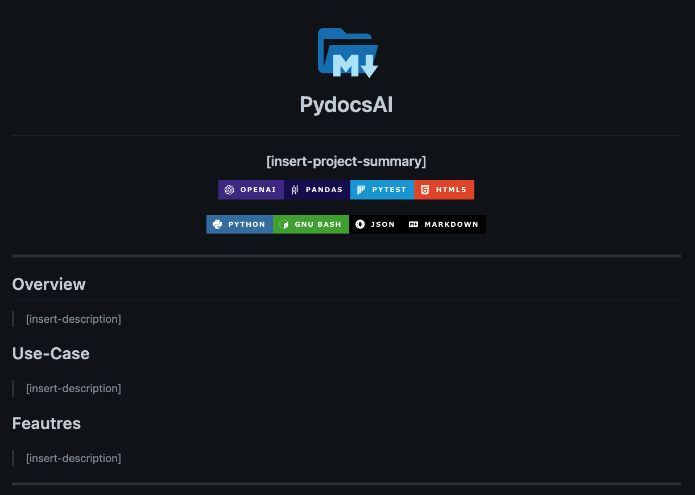

<div align="center">
<h1 align="center">

<div><p>PydocsAI</p></h1>
<h3 align="center">Automate README generation and codebase documentation for your projects!</h3>
<h4 align="center">🏎💨 Powered by OpenAI's language model API.</h4>


</div>

---

## Overview

PydocsAI is a Python package that provides an automated way to generate a README.md file and document your codebase. This package leverages OpenAI's GPT Davinci model to translate a given codebase to natural language, producing a structured project README template that contains codebase metadata and code documentation.

The project is still under development and is very opinionated in its setup, but it can be used as a starting point for projects that require documentation. The current version of PyDocsAI is limited to codebases written in Python.

## Use-Case

Software, data, machine learning, or any project that requires documentation!

## Feautres

### Badges

Analyzes your project's dependencies and requirements, displaying them as badges in the README's header section.

<div><details closed><summary>Example - Badges</a></summary>



</detais></div>

### Code Summary

This project leverages the base GPT Davinci model from OpenAI to translate a repository of Python code to documentaion.

<div><details closed><summary>Example - Docoumentation</a></summary>

</detais>

</div>

### Repository Tree

Creates a GitHub directory tree to display in your readme.

<div><details closed><summary>Example - Tree</a></summary>

</detais>

</div>

### README Generation

See this [Sample Markdown](docs/readme.md) for the README.md file generated running this script on this repository.

---

## Getting Started

### GitHub Repository

Copy the url of your project's GitHub repository and update the code below from `conf/conf.toml` below.

```bash
# GitHub
[github]
url = "https://github.com/eli64s/PydocsAI"
```

### OpenAI API Key

<details closed>
<summary>OpenAI API Setup</summary>

Follow the steps below to create an [OpenAI API key](https://platform.openai.com/docs/introduction).

1. Go to the OpenAI website.
2. Click the "Sign up for free" button.
3. Fill out the registration form with your information and agree to the terms of service.
4. Once logged in, click on the "API" tab.
5. Follow the instructions to create a new API key.
6. Copy the API key and keep it in a secure place.

You can now use the OpenAI API key to integrate with OpenAI's language models in your projects.
</details>

Copy your your OpenAI API key and update the code below from `scripts/run_main.sh` below.

```bash
#!/bin/bash
set +x

export OPENAI_API_KEY="<OPENAI-API-KEY>"

```

---

### Usage

```Bash
# 1. Clone GitHub repository.
git clone https://github.com/eli64s/PydocsAI && cd PydocsAI

# 2. Setup conda virtual environment.
make conda

# 3. Run the model.
bash scripts/run_model.sh
```

---

## Contribute

Contributions and suggestions welcome!

---

## Roadmap

- Add compatability for additional file types.
- Extend capabilities beyond codebase documentation

---

## References

- Profile Badges - [Aveek-Saha/GitHub-Profile-Badges](https://github.com/Aveek-Saha/GitHub-Profile-Badges)
- Automated Docstrings - [cdesarmeaux/autodocstrings](https://github.com/cdesarmeaux/autodocstrings)

---
