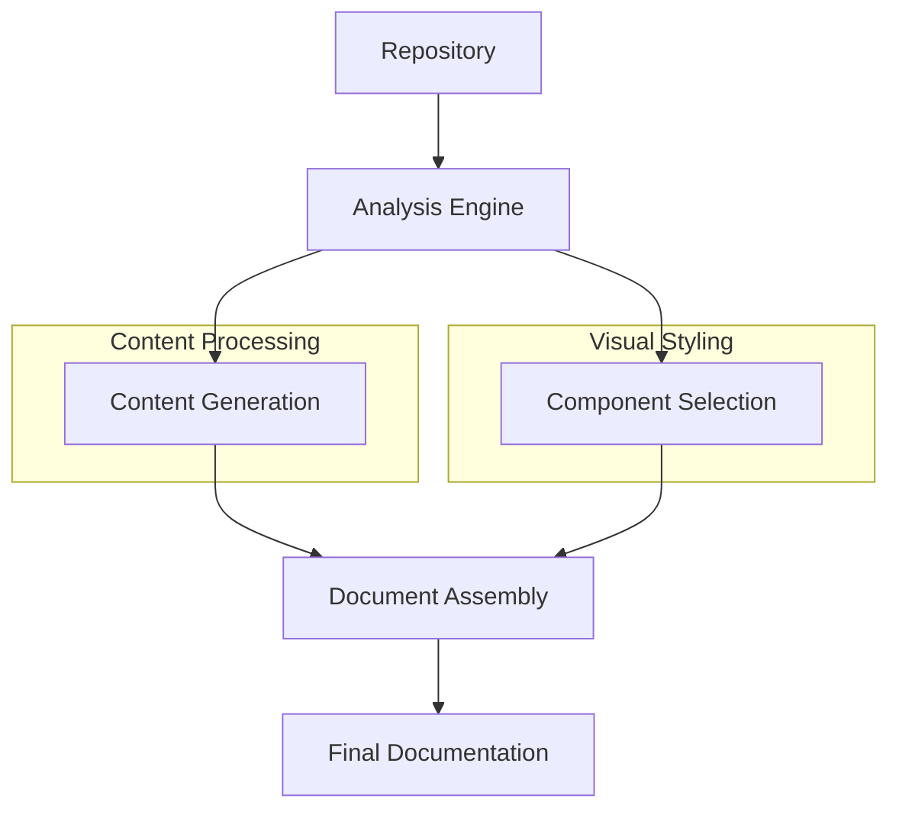

# Core Concepts

ReadmeAI approaches documentation generation through a systematic process that combines repository analysis, content generation, and visual customization. This guide will help you understand the key concepts that power ReadmeAI's functionality.

## Document Components

At its core, ReadmeAI generates documentation by assembling various components into a cohesive structure. Each component serves a specific purpose in creating clear, professional documentation:

### Document Structure

The foundation of any README is its structure - how information is organized and presented. ReadmeAI creates a logical hierarchy of sections that typically includes:

- Project overview and description
- Feature documentation
- Installation instructions
- Usage examples
- Configuration details
- Contributing guidelines

This structure ensures that readers can quickly find the information they need, whether they're first-time users or experienced contributors.

### Headers and Layout

Visual organization plays a crucial role in documentation readability. ReadmeAI offers several components for controlling document layout:

1. **Headers**: Define the document's visual identity through customizable styles:
   - Modern layouts for contemporary projects
   - Classic designs for traditional documentation
   - Banner styles for bold project branding

2. **Project Logos**: Add visual recognition through:
   - SVG-based logos for scalability
   - AI-generated logos for unique branding
   - Custom logo integration options

3. **Navigation**: Help readers move through documentation efficiently using:
   - Customizable table of contents
   - Section anchors and references
   - Hierarchical organization

### Styling Elements

ReadmeAI provides various styling components to enhance documentation appearance:

1. **Badges and Shields**: Display project status and metadata:
   - Build status indicators
   - Version information
   - License details
   - Dependency status

2. **Emoji Integration**: Add visual context to sections:
   - Themed emoji sets
   - Custom emoji mappings
   - Context-aware placement

3. **Color Themes**: Maintain visual consistency:
   - Coordinated color schemes
   - Badge color customization
   - Theme inheritance

## Content Generation

ReadmeAI's content generation system analyzes your repository to create accurate, relevant documentation:

### Repository Analysis

The analysis engine examines your codebase to understand:

- Project structure and organization
- Key files and their purposes
- Code patterns and conventions
- Documentation requirements

### Content Extraction

Intelligent extraction processes identify and document:

- Project features and capabilities
- API endpoints and interfaces
- Configuration options
- Usage patterns

### Dependency Detection

Automated scanning identifies and documents:

- Direct dependencies
- Development requirements
- Optional integrations
- Version compatibility

## Advanced Concepts

For more complex documentation needs, ReadmeAI provides advanced features:

### Ignore Patterns

Control what gets included in your documentation:

- Exclude sensitive files
- Skip test directories
- Ignore build artifacts
- Custom exclusion patterns

### Template System

Customize documentation generation:

- Custom section templates
- Layout modifications
- Content formatting rules
- Dynamic content insertion

## Integration Flow

Understanding how these concepts work together helps in creating effective documentation:

This conceptual framework allows ReadmeAI to generate documentation that is both comprehensive and visually appealing, while remaining highly customizable to meet specific project needs.

## Next Steps

After understanding these core concepts, you can:

1. Explore specific component configurations in the Document Components section
2. Learn about content generation features in Content Generation
3. Dive into advanced customization in Advanced Concepts

Each section provides detailed information about configuration options and best practices for using these features effectively.

---
