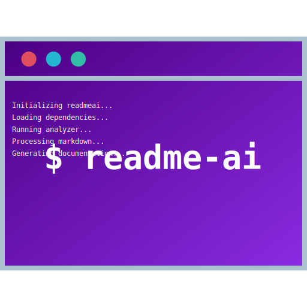

<div id="top">

<!-- HEADER STYLE: MODERN -->
<div align="left" style="position: relative; width: 100%; height: 100%; ">



# MLOPS-COURSE

<em>Empowering ML developers to innovate with confidence.<em>

<!-- BADGES -->


<em>Technology Stack:</em>


<br>


</div>
</div>
<br clear="right">

---

## ⚛️ Table of Contents

<details>
<summary>Table of Contents</summary>

- [⚛ ️ Table of Contents](#-table-of-contents)
- [🔮 Overview](#-overview)
- [💫 Features](#-features)
- [🌌 Project Structure](#-project-structure)
    - [✨ Project Index](#-project-index)
- [⚡ Getting Started](#-getting-started)
    - [💠 Prerequisites](#-prerequisites)
    - [🔷 Installation](#-installation)
    - [🔹 Usage](#-usage)
    - [🔸 Testing](#-testing)
- [🌀 Roadmap](#-roadmap)
- [✴ ️ Contributing](#-contributing)
- [⭐ License](#-license)
- [✧ Acknowledgments](#-acknowledgments)

</details>

---

## 🔮 Overview

Welcome to the mlops-course tool, a comprehensive solution for managing machine learning operations seamlessly.

**Why mlops-course?**

This project simplifies ML workflow management with key features including:

- **🚀 Automated Code Formatting:** Ensure consistent code style effortlessly.
- **💻 Efficient Deployment Configuration:** Define deployment environments with ease.
- **🔮 Streamlined Model Serving:** Deploy and run models efficiently.
- **🎯 Hyperparameter Optimization:** Optimize model training for optimal results.
- **📊 Model Evaluation Metrics:** Calculate performance metrics accurately.

---

## 💫 Features

|      | Component       | Details                              |
| :--- | :-------------- | :----------------------------------- |
| ⚙️  | **Architecture**  | <ul><li>Follows a modular design pattern.</li><li>Utilizes containerization for CI/CD with GitHub Actions workflows.</li></ul> |
| 🔩 | **Code Quality**  | <ul><li>Consistent code formatting using tools like Flake8, Black, and isort.</li><li>Includes type annotations for better code clarity.</li></ul> |
| 📄 | **Documentation** | <ul><li>Utilizes MkDocs for generating documentation.</li><li>Documentation is well-structured and easy to navigate.</li></ul> |
| 🔌 | **Integrations**  | <ul><li>Integrates with various libraries and tools like MLflow, FastAPI, and Transformers for machine learning workflows.</li><li>Pre-commit hooks for automated checks before commits.</li></ul> |
| 🧩 | **Modularity**    | <ul><li>Codebase is organized into reusable modules for better maintainability.</li><li>Separation of concerns is evident in different components.</li></ul> |
| 🧪 | **Testing**       | <ul><li>Includes comprehensive testing with pytest and pytest-cov for code coverage.</li><li>Uses MLflow for experiment tracking and model versioning.</li></ul> |
| ⚡️  | **Performance**   | <ul><li>Optimizes performance using libraries like NumPy, Pandas, and PyTorch for efficient data processing and modeling.</li><li>Utilizes hyperparameter optimization with Hyperopt for better model performance.</li></ul> |
| 🛡️ | **Security**      | <ul><li>Implements security best practices with tools like cleanlab for label noise detection and Great Expectations for data validation.</li><li>Includes linting tools like Flake8 for code quality and security checks.</li></ul> |
| 📦 | **Dependencies**  | <ul><li>Manages dependencies using a requirements.txt file and a pyproject.toml file for package management.</li><li>Includes a wide range of libraries for various tasks like data processing, modeling, and visualization.</li></ul> |

---

## 🌌 Project Structure

```sh
└── mlops-course/
    ├── .github
    ├── LICENSE
    ├── Makefile
    ├── README.md
    ├── datasets
    ├── deploy
    ├── docs
    ├── madewithml
    ├── mkdocs.yml
    ├── notebooks
    ├── pyproject.toml
    ├── requirements.txt
    └── tests
```

### ✨ Project Index

<details open>
	<summary><b><code>MLOPS-COURSE/</code></b></summary>
	<!-- __root__ Submodule -->
	<details>
		<summary><b>__root__</b></summary>
		<blockquote>
			<div class='directory-path' style='padding: 8px 0; color: #666;'>
				<code><b>⦿ __root__</b></code>
			<table style='width: 100%; border-collapse: collapse;'>
			<thead>
				<tr style='background-color: #f8f9fa;'>
					<th style='width: 30%; text-align: left; padding: 8px;'>File Name</th>
					<th style='text-align: left; padding: 8px;'>Summary</th>
				</tr>
			</thead>
				<tr style='border-bottom: 1px solid #eee;'>
					<td style='padding: 8px;'><b><a href='https://github.com/GokuMohandas/mlops-course/blob/master/mkdocs.yml'>mkdocs.yml</a></b></td>
					<td style='padding: 8px;'>- Define the structure and navigation for the Made With ML website using the mkdocs.yml file<br>- Set the site name, URLs, navigation links, theme, plugins, and watch for file changes<br>- This file configures the overall appearance and functionality of the documentation site.</td>
				</tr>
				<tr style='border-bottom: 1px solid #eee;'>
					<td style='padding: 8px;'><b><a href='https://github.com/GokuMohandas/mlops-course/blob/master/requirements.txt'>requirements.txt</a></b></td>
					<td style='padding: 8px;'>Specify project dependencies and versions in the requirements.txt file for seamless setup and execution within the codebase architecture.</td>
				</tr>
				<tr style='border-bottom: 1px solid #eee;'>
					<td style='padding: 8px;'><b><a href='https://github.com/GokuMohandas/mlops-course/blob/master/Makefile'>Makefile</a></b></td>
					<td style='padding: 8px;'>- Maintain codebase cleanliness and style with Makefile commands<br>- Use style to format code and clean to remove unnecessary files<br>- Improve code readability and organization effortlessly.</td>
				</tr>
				<tr style='border-bottom: 1px solid #eee;'>
					<td style='padding: 8px;'><b><a href='https://github.com/GokuMohandas/mlops-course/blob/master/pyproject.toml'>pyproject.toml</a></b></td>
					<td style='padding: 8px;'>- Optimize code formatting and style using Black, iSort, and Flake8 configurations specified in pyproject.toml<br>- Ensure consistent code style, structure, and adherence to best practices across the project<br>- Improve readability and maintainability of the codebase through automated formatting and linting.</td>
				</tr>
			</table>
		</blockquote>
	</details>
	<!-- deploy Submodule -->
	<details>
		<summary><b>deploy</b></summary>
		<blockquote>
			<div class='directory-path' style='padding: 8px 0; color: #666;'>
				<code><b>⦿ deploy</b></code>
			<table style='width: 100%; border-collapse: collapse;'>
			<thead>
				<tr style='background-color: #f8f9fa;'>
					<th style='width: 30%; text-align: left; padding: 8px;'>File Name</th>
					<th style='text-align: left; padding: 8px;'>Summary</th>
				</tr>
			</thead>
				<tr style='border-bottom: 1px solid #eee;'>
					<td style='padding: 8px;'><b><a href='https://github.com/GokuMohandas/mlops-course/blob/master/deploy/cluster_env.yaml'>cluster_env.yaml</a></b></td>
					<td style='padding: 8px;'>- Define the deployment environment configuration for the project<br>- Specifies the base image, environment variables, Debian packages, Python dependencies, and post-build commands needed for setting up the cluster environment.</td>
				</tr>
				<tr style='border-bottom: 1px solid #eee;'>
					<td style='padding: 8px;'><b><a href='https://github.com/GokuMohandas/mlops-course/blob/master/deploy/cluster_compute.yaml'>cluster_compute.yaml</a></b></td>
					<td style='padding: 8px;'>Define cluster compute configuration for AWS deployment in us-east2 region with specified instance types, storage, and tags.</td>
				</tr>
			</table>
			<!-- jobs Submodule -->
			<details>
				<summary><b>jobs</b></summary>
				<blockquote>
					<div class='directory-path' style='padding: 8px 0; color: #666;'>
						<code><b>⦿ deploy.jobs</b></code>
					<table style='width: 100%; border-collapse: collapse;'>
					<thead>
						<tr style='background-color: #f8f9fa;'>
							<th style='width: 30%; text-align: left; padding: 8px;'>File Name</th>
							<th style='text-align: left; padding: 8px;'>Summary</th>
						</tr>
					</thead>
						<tr style='border-bottom: 1px solid #eee;'>
							<td style='padding: 8px;'><b><a href='https://github.com/GokuMohandas/mlops-course/blob/master/deploy/jobs/workloads.yaml'>workloads.yaml</a></b></td>
							<td style='padding: 8px;'>- Define deployment configurations for the workloads job in the project<br>- Specifies project ID, cluster environment, compute configuration, runtime environment settings, entry point script, and retry policy<br>- Update relevant fields like usernames before deployment.</td>
						</tr>
						<tr style='border-bottom: 1px solid #eee;'>
							<td style='padding: 8px;'><b><a href='https://github.com/GokuMohandas/mlops-course/blob/master/deploy/jobs/workloads.sh'>workloads.sh</a></b></td>
							<td style='padding: 8px;'>- Execute a script to run tests, train a model, evaluate performance, and save results to S3<br>- The script sets up necessary environment variables, runs tests on data and code, trains a model, evaluates it, and saves results to S3 for further analysis and deployment.</td>
						</tr>
					</table>
				</blockquote>
			</details>
			<!-- services Submodule -->
			<details>
				<summary><b>services</b></summary>
				<blockquote>
					<div class='directory-path' style='padding: 8px 0; color: #666;'>
						<code><b>⦿ deploy.services</b></code>
					<table style='width: 100%; border-collapse: collapse;'>
					<thead>
						<tr style='background-color: #f8f9fa;'>
							<th style='width: 30%; text-align: left; padding: 8px;'>File Name</th>
							<th style='text-align: left; padding: 8px;'>Summary</th>
						</tr>
					</thead>
						<tr style='border-bottom: 1px solid #eee;'>
							<td style='padding: 8px;'><b><a href='https://github.com/GokuMohandas/mlops-course/blob/master/deploy/services/serve_model.yaml'>serve_model.yaml</a></b></td>
							<td style='padding: 8px;'>Define deployment configuration for serving machine learning models with Ray Serve in the project architecture.</td>
						</tr>
						<tr style='border-bottom: 1px solid #eee;'>
							<td style='padding: 8px;'><b><a href='https://github.com/GokuMohandas/mlops-course/blob/master/deploy/services/serve_model.py'>serve_model.py</a></b></td>
							<td style='padding: 8px;'>- Serve model by deploying and running the specified model with a threshold of 0.9<br>- Copies model artifacts and results from S3 to the local directory<br>- Binds the model deployment to a specific run ID for execution.</td>
						</tr>
					</table>
				</blockquote>
			</details>
		</blockquote>
	</details>
	<!-- madewithml Submodule -->
	<details>
		<summary><b>madewithml</b></summary>
		<blockquote>
			<div class='directory-path' style='padding: 8px 0; color: #666;'>
				<code><b>⦿ madewithml</b></code>
			<table style='width: 100%; border-collapse: collapse;'>
			<thead>
				<tr style='background-color: #f8f9fa;'>
					<th style='width: 30%; text-align: left; padding: 8px;'>File Name</th>
					<th style='text-align: left; padding: 8px;'>Summary</th>
				</tr>
			</thead>
				<tr style='border-bottom: 1px solid #eee;'>
					<td style='padding: 8px;'><b><a href='https://github.com/GokuMohandas/mlops-course/blob/master/madewithml/config.py'>config.py</a></b></td>
					<td style='padding: 8px;'>- Configure logging, MLflow, and directory paths in the project<br>- Set up loggers for different levels and store logs in designated directories<br>- Define constraints for stopwords used in the project.</td>
				</tr>
				<tr style='border-bottom: 1px solid #eee;'>
					<td style='padding: 8px;'><b><a href='https://github.com/GokuMohandas/mlops-course/blob/master/madewithml/models.py'>models.py</a></b></td>
					<td style='padding: 8px;'>- Define a model architecture for fine-tuning a Large Language Model (LLM)<br>- The code implements a neural network with dropout and linear layers to classify text data into multiple classes<br>- It leverages PyTorch for efficient deep learning computations.</td>
				</tr>
				<tr style='border-bottom: 1px solid #eee;'>
					<td style='padding: 8px;'><b><a href='https://github.com/GokuMohandas/mlops-course/blob/master/madewithml/predict.py'>predict.py</a></b></td>
					<td style='padding: 8px;'>- Generates predictions for project tags based on input title and description using the best checkpoint from an MLflow experiment<br>- The code leverages a TorchPredictor to process input data and provide tag predictions with associated probabilities<br>- The predict.py file encapsulates functions for decoding indices to labels, formatting probabilities, and retrieving the best checkpoint for inference.</td>
				</tr>
				<tr style='border-bottom: 1px solid #eee;'>
					<td style='padding: 8px;'><b><a href='https://github.com/GokuMohandas/mlops-course/blob/master/madewithml/serve.py'>serve.py</a></b></td>
					<td style='padding: 8px;'>- Serve.py initializes a FastAPI application for deploying machine learning models<br>- It handles health checks, retrieves run IDs, evaluates models, and makes predictions with custom logic<br>- The code integrates with MLflow for model tracking and leverages Ray for efficient serving.</td>
				</tr>
				<tr style='border-bottom: 1px solid #eee;'>
					<td style='padding: 8px;'><b><a href='https://github.com/GokuMohandas/mlops-course/blob/master/madewithml/utils.py'>utils.py</a></b></td>
					<td style='padding: 8px;'>- The code file <code>utils.py</code> provides essential functions for setting seeds, loading/saving dictionaries, padding arrays, converting batches, and retrieving MLflow run IDs<br>- These functions ensure data consistency, reproducibility, and seamless integration with MLflow for efficient experimentation and model training within the project architecture.</td>
				</tr>
				<tr style='border-bottom: 1px solid #eee;'>
					<td style='padding: 8px;'><b><a href='https://github.com/GokuMohandas/mlops-course/blob/master/madewithml/tune.py'>tune.py</a></b></td>
					<td style='padding: 8px;'>- Optimize hyperparameters for training workloads using a robust tuning experiment<br>- Configure dataset, preprocessing, trainer, and search algorithms to find the best model parameters<br>- Utilize Ray for distributed computing and MLflow for experiment tracking<br>- Achieve optimal results through efficient hyperparameter search and tuning strategies.</td>
				</tr>
				<tr style='border-bottom: 1px solid #eee;'>
					<td style='padding: 8px;'><b><a href='https://github.com/GokuMohandas/mlops-course/blob/master/madewithml/train.py'>train.py</a></b></td>
					<td style='padding: 8px;'>- Train model function to distribute workload, utilizing Ray for scalability<br>- It trains a model using specified dataset and hyperparameters, reporting results<br>- The function orchestrates training loops across multiple workers, leveraging GPUs if available<br>- It integrates MLflow for experiment tracking and checkpointing for model persistence<br>- The process includes data preprocessing, model training, and result logging.</td>
				</tr>
				<tr style='border-bottom: 1px solid #eee;'>
					<td style='padding: 8px;'><b><a href='https://github.com/GokuMohandas/mlops-course/blob/master/madewithml/evaluate.py'>evaluate.py</a></b></td>
					<td style='padding: 8px;'>- Evaluate model performance metrics on a dataset using the provided code file<br>- Calculate overall and per-class metrics, along with slice-specific metrics for NLP projects and short text descriptions<br>- The code loads data, makes predictions, and logs results, offering insights into model effectiveness across different slices.</td>
				</tr>
				<tr style='border-bottom: 1px solid #eee;'>
					<td style='padding: 8px;'><b><a href='https://github.com/GokuMohandas/mlops-course/blob/master/madewithml/data.py'>data.py</a></b></td>
					<td style='padding: 8px;'>- Load and preprocess data, split into train/test sets, and clean text using stopwords<br>- Tokenize text inputs using a BERT tokenizer and preprocess data for model training<br>- Custom preprocessor class for fitting and transforming data.</td>
				</tr>
			</table>
		</blockquote>
	</details>
	<!-- .github Submodule -->
	<details>
		<summary><b>.github</b></summary>
		<blockquote>
			<div class='directory-path' style='padding: 8px 0; color: #666;'>
				<code><b>⦿ .github</b></code>
			<!-- workflows Submodule -->
			<details>
				<summary><b>workflows</b></summary>
				<blockquote>
					<div class='directory-path' style='padding: 8px 0; color: #666;'>
						<code><b>⦿ .github.workflows</b></code>
					<table style='width: 100%; border-collapse: collapse;'>
					<thead>
						<tr style='background-color: #f8f9fa;'>
							<th style='width: 30%; text-align: left; padding: 8px;'>File Name</th>
							<th style='text-align: left; padding: 8px;'>Summary</th>
						</tr>
					</thead>
						<tr style='border-bottom: 1px solid #eee;'>
							<td style='padding: 8px;'><b><a href='https://github.com/GokuMohandas/mlops-course/blob/master/.github/workflows/serve.yaml'>serve.yaml</a></b></td>
							<td style='padding: 8px;'>Enable serving the model by configuring AWS credentials, setting up dependencies, and deploying the model using AnyScale.</td>
						</tr>
						<tr style='border-bottom: 1px solid #eee;'>
							<td style='padding: 8px;'><b><a href='https://github.com/GokuMohandas/mlops-course/blob/master/.github/workflows/json_to_md.py'>json_to_md.py</a></b></td>
							<td style='padding: 8px;'>- Converts JSON data into Markdown format, facilitating easy documentation creation<br>- Parses JSON keys and values, generating structured tables for nested data and lists<br>- The script reads a JSON file, processes its content, and saves the formatted Markdown output to a specified file.</td>
						</tr>
						<tr style='border-bottom: 1px solid #eee;'>
							<td style='padding: 8px;'><b><a href='https://github.com/GokuMohandas/mlops-course/blob/master/.github/workflows/workloads.yaml'>workloads.yaml</a></b></td>
							<td style='padding: 8px;'>- Automate AWS workload deployment, result retrieval, and PR commenting<br>- Configure AWS credentials, set up dependencies, run workloads, fetch results from S3, and comment on PRs with training and evaluation results.</td>
						</tr>
						<tr style='border-bottom: 1px solid #eee;'>
							<td style='padding: 8px;'><b><a href='https://github.com/GokuMohandas/mlops-course/blob/master/.github/workflows/documentation.yaml'>documentation.yaml</a></b></td>
							<td style='padding: 8px;'>Generate and deploy documentation using MkDocs and MkDocstrings for the projects main branch.</td>
						</tr>
					</table>
				</blockquote>
			</details>
		</blockquote>
	</details>
	<!-- notebooks Submodule -->
	<details>
		<summary><b>notebooks</b></summary>
		<blockquote>
			<div class='directory-path' style='padding: 8px 0; color: #666;'>
				<code><b>⦿ notebooks</b></code>
			<table style='width: 100%; border-collapse: collapse;'>
			<thead>
				<tr style='background-color: #f8f9fa;'>
					<th style='width: 30%; text-align: left; padding: 8px;'>File Name</th>
					<th style='text-align: left; padding: 8px;'>Summary</th>
				</tr>
			</thead>
				<tr style='border-bottom: 1px solid #eee;'>
					<td style='padding: 8px;'><b><a href='https://github.com/GokuMohandas/mlops-course/blob/master/notebooks/benchmarks.ipynb'>benchmarks.ipynb</a></b></td>
					<td style='padding: 8px;'>- Project SummaryThe <code>benchmarks.ipynb</code> notebook within the project serves as a comprehensive guide for evaluating and comparing the performance metrics of various components within the codebase<br>- It provides a structured approach to conducting benchmarks, analyzing results, and making informed decisions based on the performance data gathered<br>- This notebook is essential for ensuring that the codebase maintains optimal performance levels and can assist in identifying areas for potential optimization and enhancement.</td>
				</tr>
				<tr style='border-bottom: 1px solid #eee;'>
					<td style='padding: 8px;'><b><a href='https://github.com/GokuMohandas/mlops-course/blob/master/notebooks/madewithml.ipynb'>madewithml.ipynb</a></b></td>
					<td style='padding: 8px;'>- Project SummaryThe <code>madewithml.ipynb</code> notebook file within the project serves as a central hub for showcasing the Made With ML platform, emphasizing its core mission of enabling developers to engage with Machine Learning (ML) through a comprehensive approach encompassing design, development, deployment, and iteration<br>- This notebook acts as a gateway for developers to explore and leverage ML concepts and tools within a structured and user-friendly environment, fostering a community-driven ethos of learning and growth in the ML domain.</td>
				</tr>
			</table>
		</blockquote>
	</details>
</details>

---

## ⚡ Getting Started

### 💠 Prerequisites

This project requires the following dependencies:

- **Programming Language:** Python
- **Package Manager:** Pip

### 🔷 Installation

Build mlops-course from the source and intsall dependencies:

1. **Clone the repository:**

    ```sh
    ❯ git clone https://github.com/GokuMohandas/mlops-course
    ```

2. **Navigate to the project directory:**

    ```sh
    ❯ cd mlops-course
    ```

3. **Install the dependencies:**

<!-- SHIELDS BADGE CURRENTLY DISABLED -->
	<!-- [![pip][pip-shield]][pip-link] -->
	<!-- REFERENCE LINKS -->
	<!-- [pip-shield]: https://img.shields.io/badge/Pip-3776AB.svg?style={badge_style}&logo=pypi&logoColor=white -->
	<!-- [pip-link]: https://pypi.org/project/pip/ -->

	**Using [pip](https://pypi.org/project/pip/):**

	```sh
	❯ pip install -r requirements.txt
	```


### 🔹 Usage

Run the project with:

**Using [pip](https://pypi.org/project/pip/):**
```sh
python {entrypoint}
```

### 🔸 Testing

Mlops-course uses the {__test_framework__} test framework. Run the test suite with:

**Using [pip](https://pypi.org/project/pip/):**
```sh
pytest
```


---

## 🌀 Roadmap

- [X] **`Task 1`**: <strike>Implement feature one.</strike>
- [ ] **`Task 2`**: Implement feature two.
- [ ] **`Task 3`**: Implement feature three.

---

## ✴️ Contributing

- **💬 [Join the Discussions](https://github.com/GokuMohandas/mlops-course/discussions)**: Share your insights, provide feedback, or ask questions.
- **🐛 [Report Issues](https://github.com/GokuMohandas/mlops-course/issues)**: Submit bugs found or log feature requests for the `mlops-course` project.
- **💡 [Submit Pull Requests](https://github.com/GokuMohandas/mlops-course/blob/main/CONTRIBUTING.md)**: Review open PRs, and submit your own PRs.

<details closed>
<summary>Contributing Guidelines</summary>

1. **Fork the Repository**: Start by forking the project repository to your github account.
2. **Clone Locally**: Clone the forked repository to your local machine using a git client.
   ```sh
   git clone https://github.com/GokuMohandas/mlops-course
   ```
3. **Create a New Branch**: Always work on a new branch, giving it a descriptive name.
   ```sh
   git checkout -b new-feature-x
   ```
4. **Make Your Changes**: Develop and test your changes locally.
5. **Commit Your Changes**: Commit with a clear message describing your updates.
   ```sh
   git commit -m 'Implemented new feature x.'
   ```
6. **Push to github**: Push the changes to your forked repository.
   ```sh
   git push origin new-feature-x
   ```
7. **Submit a Pull Request**: Create a PR against the original project repository. Clearly describe the changes and their motivations.
8. **Review**: Once your PR is reviewed and approved, it will be merged into the main branch. Congratulations on your contribution!
</details>

<details closed>
<summary>Contributor Graph</summary>
<br>
<p align="left">
   <a href="https://github.com{/GokuMohandas/mlops-course/}graphs/contributors">
      
   </a>
</p>
</details>

---

## ⭐ License

Mlops-course is protected under the [LICENSE](https://choosealicense.com/licenses) License. For more details, refer to the [LICENSE](https://choosealicense.com/licenses/) file.

---

## ✧ Acknowledgments

- Credit `contributors`, `inspiration`, `references`, etc.

<div align="left"><a href="#top">⬆ Return</a></div>

---

<!-- README-AI COMMAND: -->
<!--
```sh
readmeai \
    --repository 'https://github.com/GokuMohandas/mlops-course' \
    --output 'docs/docs/examples/generated/tmp/readme-mlops-course.md' \
    --badge-style 'plastic' \
    --badge-color '4169e1' \
    --logo 'TERMINAL' \
    --header-style 'MODERN' \
    --navigation-style 'ACCORDION' \
    --emojis 'quantum' \
    --temperature 0.116 \
    --tree-max-depth 1 \
    --api openai
```
-->
