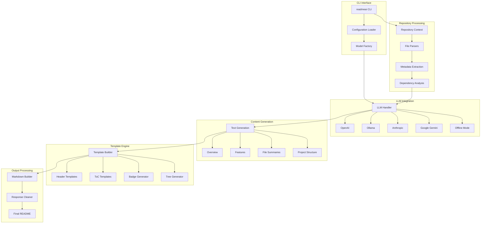

# Philosophy and Vision

## Empowering Developers, Enlightening Projects

<!--
README files are essential for project discoverability, collaboration, and maintenance. However, creating and maintaining them can be time-consuming and tedious.
-->

ReadmeAI envisions a future where every software project, regardless of size or complexity, is accompanied by clear, comprehensive, and up-to-date documentation. We strive to create an ecosystem where documentation is no longer an afterthought but an integral, effortless part of the development process.

### Our Core Vision

1. **Democratize Quality Documentation**
   - Make professional-grade documentation accessible to all developers, from hobbyists to enterprise teams.
   - Break down language barriers by offering multilingual documentation generation.

2. **Accelerate Open Source Adoption**
   - Enhance the discoverability and usability of open source projects through superior documentation.
   - Foster a more inclusive open source community by lowering the barrier to contribution.

3. **Evolve with AI Advancements**
   - Continuously integrate cutting-edge AI technologies to improve documentation quality and generation speed.
   - Pioneer new ways of understanding and describing code structures and functionalities.

4. **Cultivate Documentation Best Practices**
   - Establish Readme-ai as the gold standard for project documentation in the software industry.
   - Encourage a culture where well-documented projects are the norm, not the exception.

5. **Enhance Developer Productivity**
   - Free developers to focus on coding by automating the documentation process.
   - Reduce the time from development to deployment by streamlining the documentation workflow.

6. **Promote Code Understanding**
   - Facilitate better code comprehension across teams and organizations.
   - Bridge the gap between technical and non-technical stakeholders through clear, AI-generated explanations.

7. **Ensure Adaptability and Extensibility**
   - Create a flexible platform that can easily integrate with various development workflows and tools.
   - Build a robust plugin ecosystem that allows the community to extend Readme-ai's capabilities.

8. **Champion Ethical AI Use**
   - Lead by example in the responsible and transparent use of AI in developer tools.
   - Prioritize user privacy and data security in all aspects of our AI-driven processes.

### Long-Term Impact

We see Readme-ai as a catalyst for a paradigm shift in software development practices. By making high-quality documentation effortless and ubiquitous, we aim to:

- Accelerate innovation by making it easier for developers to build upon each other's work.
- Improve software quality by encouraging better-documented and more maintainable codebases.
- Enhance collaboration within and between development teams through clearer project communication.
- Increase the overall efficiency of the software development lifecycle.

Through Readme-ai, we aspire to create a world where every line of code is matched by a line of clear, concise, and helpful documentation, empowering developers and enlightening projects for the benefit of all.

---

## Architecture Diagram

---
