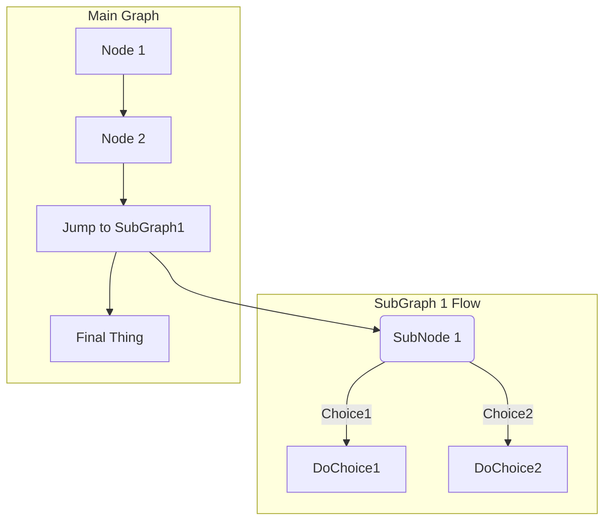
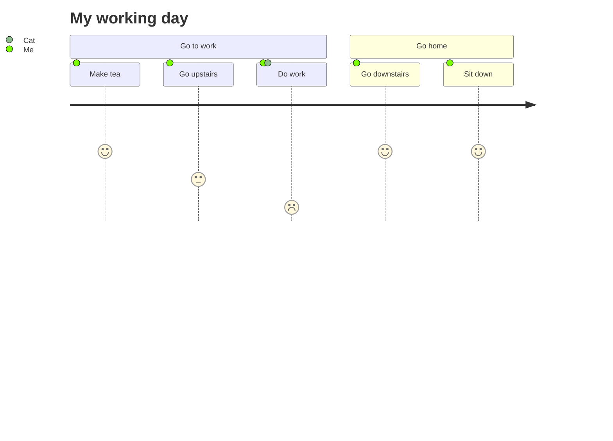
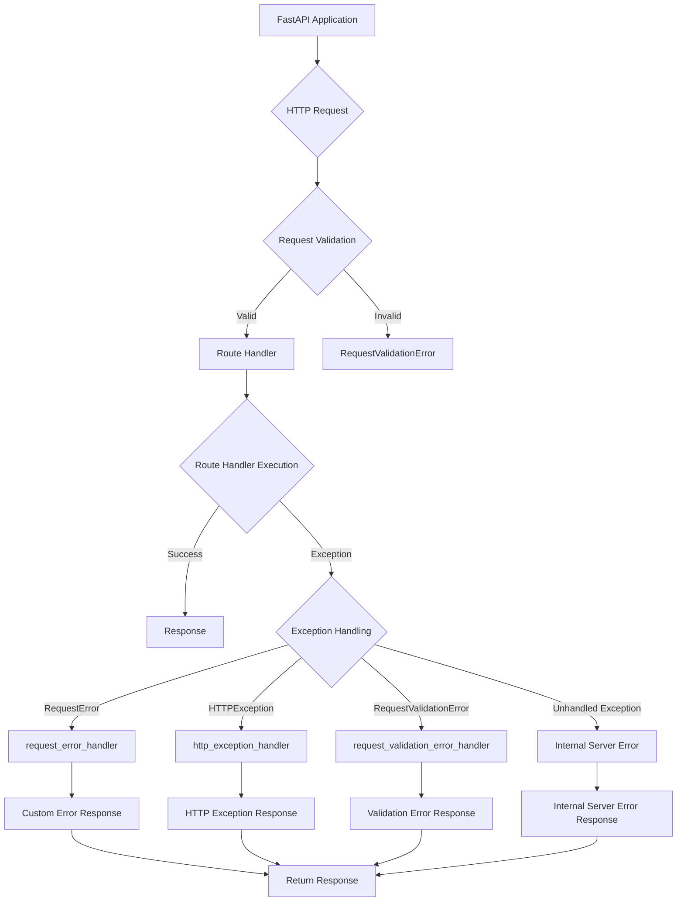

# Markdown Best Practices

This document provides a comprehensive guide to writing technical documentation using the `GitHub flavored markdown spec`. This guide includes examples of how to use various markdown elements to create visually appealing and informative documentation.

## Table of Contents

<!-- TOC depthfrom:3 depthto:4 orderedlist:false -->

- [Markdown Horizontal Rule](#markdown-horizontal-rule)
- [HTML Horizontal Rule](#html-horizontal-rule)
- [Table with Alignment](#table-with-alignment)
    - [Multi-Line Table Cells](#multi-line-table-cells)
    - [Task Lists](#task-lists)
    - [Merge Cells](#merge-cells)
- [Progress Bars](#progress-bars)
- [Highlighting](#highlighting)
- [Underlining](#underlining)
- [Keyboard Shortcuts](#keyboard-shortcuts)
    - [Navigating](#navigating)
    - [Editing](#editing)
- [Centered Images](#centered-images)
- [Horizontally Aligned Images](#horizontally-aligned-images)
- [Small Images](#small-images)
- [Text Boxes](#text-boxes)
- [Text Wrapping](#text-wrapping)
- [Inline Links](#inline-links)
- [Reference Links](#reference-links)
- [Simple Contact](#simple-contact)
- [Modern Contact with Social Icons](#modern-contact-with-social-icons)
- [Contributing Graph](#contributing-graph)

---

## Line Separators

### Markdown Horizontal Rule

```markdown

section end

---

```

```markdown
section end

***

```

### HTML Horizontal Rule

```html
<p>section end</p>

<hr>

```

---

## Lists

Things I need to do today:
1. Fix usability problem
2. Clean up the page
   * Make the headings bigger
2. Push my changes
3. Create code review
   * Describe my changes
   * Assign reviewers
     * Ask for feedback

---

## Tables

### Table with Alignment

```markdown
| Left Aligned | Centered | Right Aligned |
| :---         | :---:    | ---:          |
| Cell 1       | Cell 2   | Cell 3        |
| Cell 4       | Cell 5   | Cell 6        |
```

This will render as:

| Left Aligned | Centered | Right Aligned |
| :---         | :---:    | ---:          |
| Cell 1       | Cell 2   | Cell 3        |
| Cell 4       | Cell 5   | Cell 6        |

#### Multi-Line Table Cells

```markdown
| Name | Details |
| ---  | ---     |
| Item1 | This text is on one line |
| Item2 | This item has:<br>- Multiple items<br>- That we want listed separately |
```

This will render as:

| Name | Details |
| ---  | ---     |
| Item1 | This text is on one line |
| Item2 | This item has:<br>- Multiple items<br>- That we want listed separately |

#### Task Lists

```markdown
| header 1 | header 2 |
| ---      | ---      |
| cell 1   | cell 2   |
| cell 3   | <ul><li> - [ ] Task one </li><li> - [ ] Task two </li></ul> |
```

This will render as:

| header 1 | header 2 |
| ---      | ---      |
| cell 1   | cell 2   |
| cell 3   | <ul><li> - [ ] Task one </li><li> - [ ] Task two </li></ul> |

#### Merge Cells

```html
<table>
  <tr>
    <td colspan="2">I take up two columns!</td>
  </tr>
  <tr>
    <td>First column</td>
    <td>Second column</td>
  </tr>
</table>
```

This will render as:

<table>
  <tr>
    <td colspan="2">I take up two columns!</td>
  </tr>
  <tr>
    <td>First column</td>
    <td>Second column</td>
  </tr>
</table>

---

## Text Styling & Formatting

- ~~strikethrough~~ or <del>strikethrough</del>
- H~2~O is a liquid and C~6~H~12~O~6~ is a sugar.
- 19^th^
- X^2^ + Y^2^ = Z^2^
- z<sup>2</sup> + c
- [<kbd> <br> Install <br> </kbd>](https://notes.aliciasykes.com/36402/github-markdown-tricks)

### Progress Bars

<progress value="22" max="100"></progress> 22%
<progress value="48" max="100"></progress> 48%
<progress value="77" max="100"></progress> 77%

### Highlighting

<mark>highlighted text</mark>.

### Underlining

<ins>I'm Underlined!</ins>

---

## Buttons & Keyboard Shortcuts

|[Click here](https://github.com/)|
|---|

|[Click here](https://github.com/)|[Or here](https://github.com/)|[Or here](https://github.com/)|
|---|---|---|

<button class="button-save large">Big Fat Button</button>

***

### Keyboard Shortcuts

Press <kbd>Enter</kbd> to go to the next page.

#### Navigating

You can navigate through your items or search results using the keyboard. You can use <kbd>Tab</kbd> to cycle through results, and <kbd>Shift</kbd> + <kbd>Tab</kbd> to go backwards. Or use the arrow keys, <kbd>↑</kbd>, <kbd>→</kbd>, <kbd>↓</kbd> and <kbd>←</kbd>.

<p>To copy the selected text, press <kbd><kbd>Ctrl</kbd> + <kbd>C</kbd></kbd>.</p>

#### Editing

Press <kbd>Ctrl</kbd> + <kbd>S</kbd> to save your changes.
Select text and press <kbd>Ctrl</kbd> + <kbd>B</kbd> to make it bold.

---

## Math Equations

$$
\begin{aligned}
\dot{x} & = \sigma(y-x) \\
\dot{y} & = \rho x - y - xz \\
\dot{z} & = -\beta z + xy
\end{aligned}
$$

$$
L = \frac{1}{2} \rho v^2 S C_L
$$

---

## Images

### Centered Images

<p align="center">
  
</p>

### Horizontally Aligned Images

<p>
    
    
</p>

### Small Images

 **Code documentation** - Generated directory tree structure and summaries of the key files in your codebase.

 **Spike documentation** - Generated directory tree structure and summaries of the key files in your codebase.

 **Chunking documentation** - Generated directory tree structure and summaries of the key files in your codebase.

### Text Boxes

<div align="center">
<table>
<tbody>
<td align="center">
<br>
<sub>This is text in the box. Much wow</sub><br>

</td>
</tbody>
</table>
</div>

### Text Wrapping


At the 2019 rendition of E3, an eccentric gamer in attendance interrupted Keanu Reeves' presentation of the role-playing game (RPG) Cyberpunk 2077, loudly claiming, “"You're breathtaking,"” which was directed at the actor-cum-presenter. The image macro used to build the "You're Breathtaking" meme generally features a still of Keanu Reeves pointing at someone in the audience in front of him - that someone is Peter Sark, though there are no images from Keanu's point of view that have since been used as part of the "You're Breathtaking" meme.

<!--

### Scalable Vector Graphics aka SVGs

<svg width="400" height="110">
  <rect width="300" height="100" style="fill:rgb(0,0,255);stroke-width:3;stroke:rgb(0,0,0)" />
  <text x="150" y="55" font-size="60" fill="white" text-anchor="middle">SVG</text>
</svg>

-->

---

## Mermaid Diagrams

- [Mermaid Live Editor](https://mermaid-js.github.io/mermaid-live-editor/edit#pako:eNpVjstqw0AMRX9FaNVC_ANeFBq7zSbQQrPzZCFsOTMk80CWCcH2v3ccb1qtxD3nCk3Yxo6xxP4W760lUTjVJkCe96ay4gb1NJyhKN7mAyv4GPgxw_7lEGGwMSUXLq-bv18lqKbjqjGodeG6bKh69r8Cz1A3R0oa0_kvOd3jDB-N-7b5_H9ihXPrs-mp7KloSaAieSq4Q8_iyXX5_WlNDKplzwbLvHYkV4MmLNmjUePPI7RYqoy8wzF1pFw7ugj5LVx-AfLqVWg)








<script>
  const config = {
    startOnLoad: true,
    securityLevel: 'loose',
    sankey: {
      width: 800,
      height: 400,
      linkColor: 'source',
      nodeAlignment: 'left',
    },
  };
  mermaid.initialize(config);
</script>

---

## Return To Top

<p align="left"><a href="#markdown-advanced-usage"><b>Return</b></a></p>
<p align="center"><a href="#markdown-advanced-usage"><b>Return</b></a></p>
<p align="right"><a href="#markdown-advanced-usage"><b>Return</b></a></p>

---

## HTML Spacing Entities

| Name                  | HTML Entity  | Description                                       |
|-----------------------|--------------|---------------------------------------------------|
| En space              | `&ensp;`     | Half the width of an em space                     |
| Em space              | `&emsp;`     | Width of an em space (equal to the font size)     |
| Three-per-em space    | `&emsp13;`   | One-third of an em space                          |
| Figure space          | `&numsp;`    | Width of a numeral (digit)                        |
| Punctuation space     | `&puncsp;`   | Width of a period or comma                        |
| Thin space            | `&thinsp;`   | Thinner than a regular space                      |
| Hair space            | `&hairsp;`   | Thinner than a thin space                         |
| Narrow no-break space | `&#8239;`    | Non-breaking thin space                           |

**Note:** The `&emsp13;` and `&puncsp;` entities may not be supported in all browsers. For the narrow no-break space, there isn't a named HTML entity, so the numeric character reference `&#8239;` is used.

---

## Links

### Inline Links

[inline link](http://example.com)
[reference link][reference]

### Reference Links

[reference]: http://example.com

[reference link 2][1]

[1]: https://www.jetbrains.com

---

## Contact

### Simple Contact

If you have any questions or comments, feel free to reach out to me!
- Email: your-email@example.com
- Twitter: [@YourHandle](https://twitter.com/YourHandle)

<!--
#### <div align="center">Contact</div>
-->

### Modern Contact with Social Icons

<p align="center">
  <sub>
    For readme-ai issues and feature requests please visit our <a href="https://github.com/eli64s/readme-ai/issues">issues page</a>, or start a <a href="https://github.com/eli64s/readme-ai/discussions">discussion!</a>
  </sub><br>
</p>
<div align="center">
  <a href="https://github.com/eli64s"></a>
  
  <a href="https://www.linkedin.com/company/ultralytics/"></a>
  
  <a href="https://twitter.com/ultralytics"></a>
  
</div>

---

## Contributing Guidelines

### Contributing Graph

<p align="center">
  <a href="https://github.com{/eli64s/readme-ai/}graphs/contributors">
    
  </a>
</p>

---

## References

- [github-markdown-tricks](https://notes.aliciasykes.com/36402/github-markdown-tricks)

---

## Footnotes

Here's a sample sentence with a footnote.[^1]

[^1]: And here's the definition of the footnote.

---
